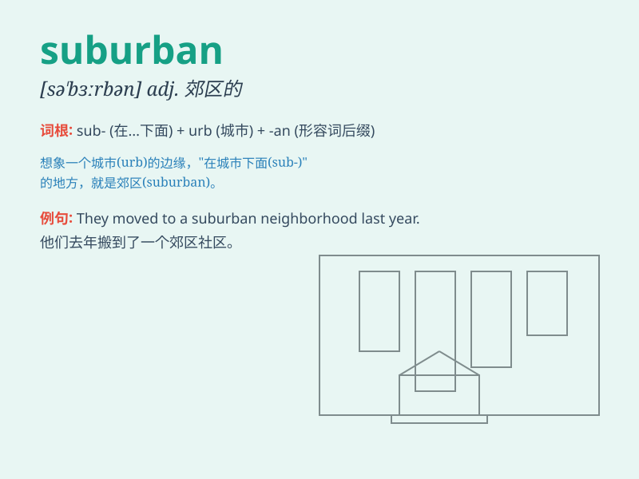

## suburban

**英音:** _[sə\'bɜːb(ə)n]_ **美音:** _[sə\'bɝbən]_

**译义:** *adj.郊外的,偏远的*

### 短语

+ **suburban area:** _郊区_

+ **suburban life:** _郊区生活_

+ **suburban development:** _郊区发展_

+ **suburban train:** _郊区火车_

+ **suburban housing:** _郊区住房_

### 例句

#### 例句1

> **She lives in a suburban area outside the city.**

**中文翻译:** 她住在城外的郊区。

**单词释义:** 郊区的

#### 例句2

> **The suburban train was crowded during rush hour.**

**中文翻译:** 高峰时段，郊区的火车很拥挤。

**单词释义:** 郊区的

#### 例句3

> **Suburban life offers a quieter and more relaxed pace.**

**中文翻译:** 郊区的生活节奏更安静、更轻松。

**单词释义:** 郊区的

### 背诵小故事

> A man named Tom always dreamed of leaving the busy city. One day, he
moved to a suburban area. There, he enjoyed the peaceful life, with
green gardens and less noise. Finally, he found the tranquility he
desired in the suburban place.

**一个叫汤姆的男人一直梦想着离开繁忙的城市。有一天，他搬到了郊区。在那里，他享受着平静的生活，有绿色的花园和更少的噪音。最终，他在郊区找到了他渴望的宁静。**

### 图义

