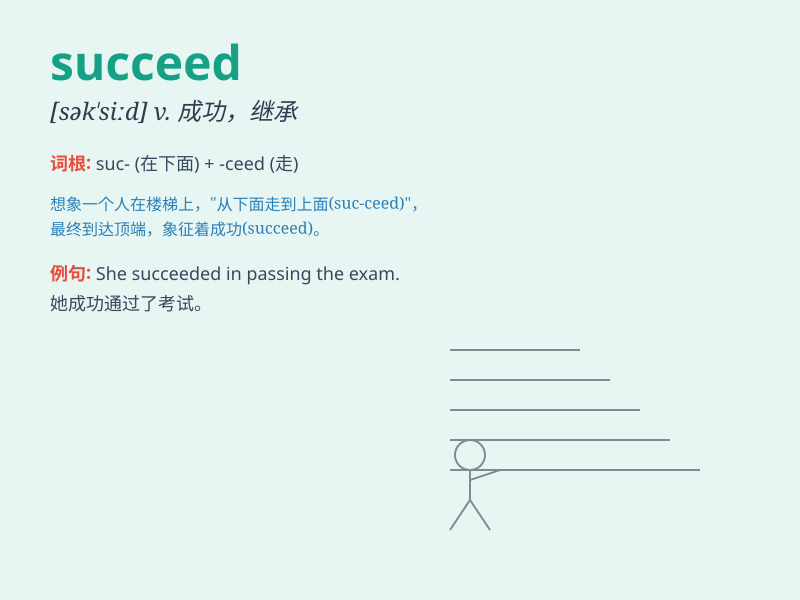

## succeed

**英音:** _[sək\'siːd]_ **美音:** _[sək\'sid]_

**译义:** *vi.(～ in) 成功v.继\...之后,继任,继承,取得成功*

### 短语

+ **succeed in:** _在......方面成功_

+ **succeed to:** _继承_

+ **succeed with:** _在......上获得成功_

+ **succeed as:** _作为......成功_

+ **succeed oneself:** _再次成功；超过自己以前的水平_

### 例句

#### 例句1

> **He worked hard and finally succeeded.**

**中文翻译:** 他努力工作，终于成功了。

**单词释义:** 成功；达成

#### 例句2

> **If you keep trying, you will succeed sooner or later.**

**中文翻译:** 如果你继续努力，迟早会成功。

**单词释义:** 成功；取得成功

#### 例句3

> **She succeeded in passing the driving test on her first
attempt.**

**中文翻译:** 她第一次尝试就成功通过了驾驶考试。

**单词释义:** 成功（做到）

### 背诵小故事

> A young man had a dream to succeed in business. He faced many
difficulties but never gave up. Finally, his hard work paid off and he
achieved great success. Now you know succeed means to achieve the
desired aim.

**一个年轻人梦想在商业上取得成功。他面临诸多困难但从不放弃。最终，他的努力得到了回报，获得了巨大成功。现在你知道
succeed 意思是达成期望的目标。**

### 图义

