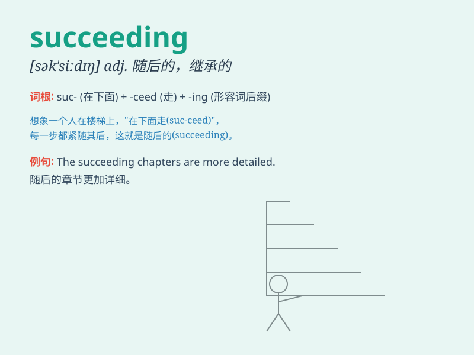

## succeeding

**英音:** _[səkˈsiːdɪŋ]_ **美音:** _[səkˈsidɪŋ]_

**译义:** *正在成功；继\...之后；adj. 下列的，接着的*

### 例句

#### 例句1

> **The succeeding chapters of the book are even more
fascinating.**

**中文翻译:** 这本书的后续章节更加引人入胜。

**单词释义:** 后续的

#### 例句2

> **In the succeeding years, she achieved great success in her
career.**

**中文翻译:** 在接下来的几年里，她在事业上取得了巨大的成功。

**单词释义:** 接下来的

#### 例句3

> **The succeeding generation has new challenges to face.**

**中文翻译:** 下一代人有新的挑战要面对。

**单词释义:** 接下来的；随后的

### 背诵小故事

> A young athlete was determined to succeed. After countless efforts
and failures, he kept going. Finally, in the succeeding races, he won
one after another. His hard work paid off.

**一位年轻的运动员决心取得成功。经过无数次的努力和失败，他坚持不懈。最终，在接下来的比赛中，他接连获胜。他的努力得到了回报。**

### 图义

