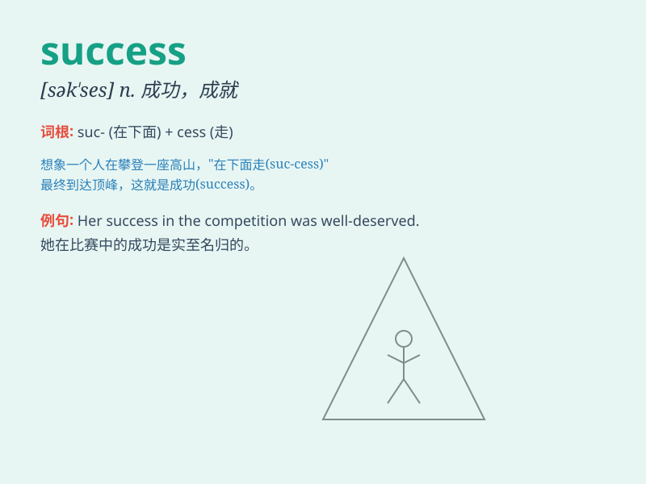

## success

**英音:** _[sək\'ses]_ **美音:** _[sək\'sɛs]_

**译义:** *n.成功,成就,胜利,发迹,兴旺*

### 短语

+ **success rate:** _成功率_

+ **success story:** _成功的故事_

+ **achieve success:** _取得成功_

+ **success factor:** _成功因素_

+ **great success:** _巨大的成功_

### 例句

#### 例句1

> **His success in business is remarkable.**

**中文翻译:** 他在商业上的成功是令人瞩目的。

**单词释义:** 成功；成就

#### 例句2

> **The success of the project depends on everyone\'s efforts.**

**中文翻译:** 项目的成功有赖于大家的努力。

**单词释义:** 成功；胜利

#### 例句3

> **She achieved great success as a writer.**

**中文翻译:** 她作为一名作家取得了巨大的成功。

**单词释义:** 成功；成就

### 背诵小故事

> A young artist struggled for years. Despite facing many rejections,
he kept working hard. Finally, his artworks were widely praised and sold
well. This was his success. It came from perseverance and passion.

**一位年轻的艺术家努力了多年。尽管面临多次拒绝，他仍坚持努力。最终，他的艺术作品广受赞誉并且畅销。这就是他的成功。成功源于坚持和热情。**

### 图义

