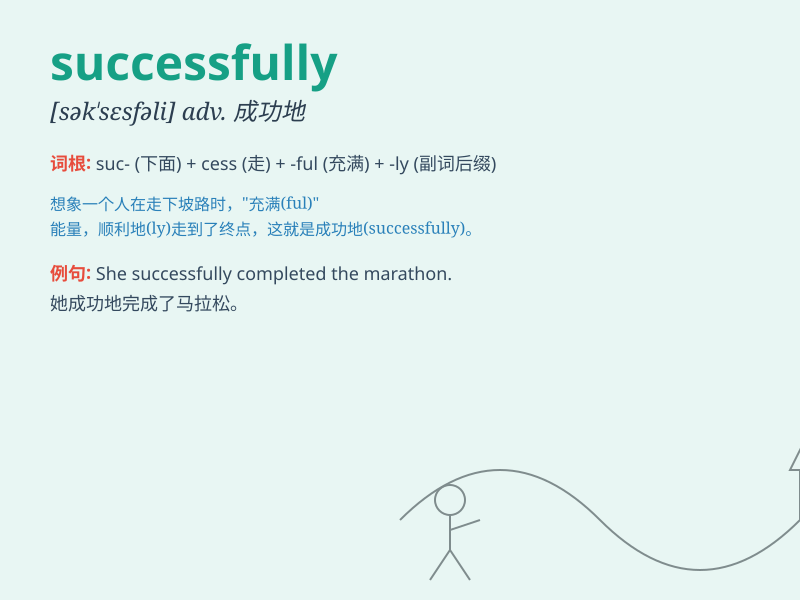

## successfully

**英音:** _[sək\'sesfəlɪ]_ **美音:** _[sək\'sɛsfəli]_

**译义:** *adv.顺利地,成功地*

### 短语

+ **achieve successfully:** _成功实现_

+ **complete successfully:** _成功完成_

+ **operate successfully:** _成功运作_

+ **execute successfully:** _成功执行_

+ **perform successfully:** _成功表演；成功执行_

### 例句

#### 例句1

> **He successfully completed the difficult task.**

**中文翻译:** 他顺利地完成了这项艰巨的任务。

**单词释义:** 成功地

#### 例句2

> **The team successfully defended their championship title.**

**中文翻译:** 球队成功卫冕冠军。

**单词释义:** 成功地

#### 例句3

> **She successfully passed the driving test on her first
attempt.**

**中文翻译:** 她第一次尝试就成功通过了驾驶考试。

**单词释义:** 成功地

### 背诵小故事

> A young athlete trained hard every day. In the big competition, he
ran fast and jumped high. Finally, he successfully won the championship.
His smile was bright as he achieved this great success.

**一位年轻的运动员每天刻苦训练。在大型比赛中，他跑得飞快，跳得很高。最终，他成功地赢得了冠军。当他取得这一巨大成功时，他的笑容灿烂。**

### 图义

