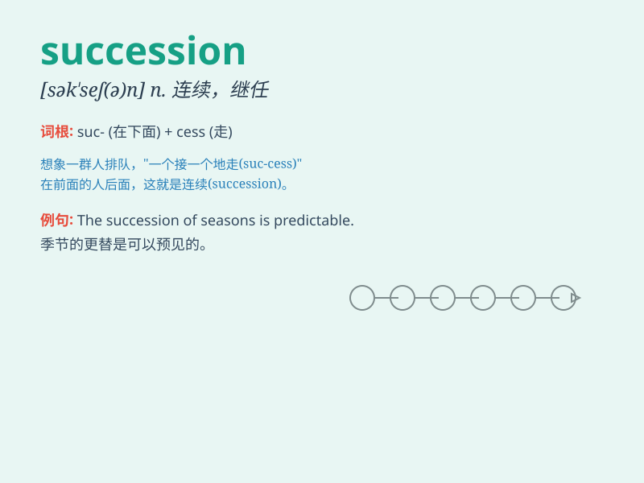

## succession

**英音:** _[sək\'seʃ(ə)n]_ **美音:** _[sək\'sɛʃən]_

**译义:** *n.连续,继承,继任,演替,[农业] 轮栽,连续性*

### 短语

+ **in succession:** _接连地；连续地_

+ **succession planning:** _继任计划；接班人计划_

+ **a succession of:** _一连串的；一系列的_

+ **succession law:** _继承法_

+ **succession certificate:** _继承证书_

### 例句

#### 例句1

> **The company has seen a smooth succession of leadership over the
years.**

**中文翻译:** 多年来，公司领导层的更替顺利。

**单词释义:** 一连串；一系列；连续

#### 例句2

> **He was the third in succession to the throne.**

**中文翻译:** 他是王位第三顺位继承人。

**单词释义:** 继承；继任

#### 例句3

> **A succession of visitors came to the house.**

**中文翻译:** 陆续有客人来到这所房子。

**单词释义:** 一连串；一系列

### 背诵小故事

> A king was worried about the succession of his throne. He had many
sons, but couldn\'t decide who would be the next. Finally, the most wise
and brave son got the succession.

**一位国王为王位的继承感到担忧。他有很多儿子，但无法决定谁是下一任。最终，最睿智勇敢的儿子获得了继承权。**

### 图义

