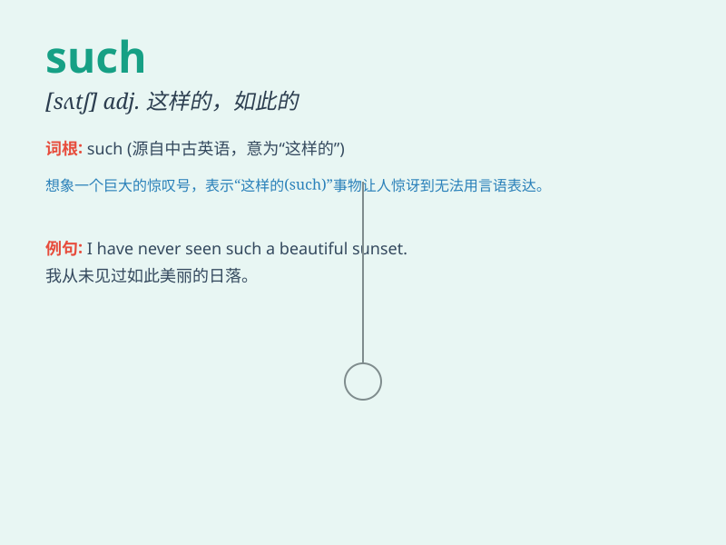

## such

**英音:** _[sʌtʃ]_ **美音:** _[sʌtʃ]_

**译义:** *adj.这样的,这种,某一 pron.这样的人(们)或物*

### 短语

+ **such as:** _例如；像；诸如_

+ **such\...that\...:** _如此......以至于......_

+ **in such a way:** _以这样的方式_

+ **such and such:** _某某；这样那样的_

+ **no such thing:** _没有这样的事_

### 例句

#### 例句1

> **Such a mistake should not be repeated.**

**中文翻译:** 这样的错误不应该再重演。

**单词释义:** 这样的；如此的

#### 例句2

> **He is not such a fool as he looks.**

**中文翻译:** 他并不像看上去那么傻。

**单词释义:** 这样的；如此的

#### 例句3

> **Such men as he are rare.**

**中文翻译:** 像他这样的人很少见。

**单词释义:** 像......这样的

### 背诵小故事

> Once upon a time, there was a magic box. Everyone wondered what was
inside. When it opened, such beautiful jewels appeared! It was a
surprise no one expected. \'Such\' here means of a particular type or
degree.

**从前，有一个魔法盒子。每个人都好奇里面有什么。当它打开时，出现了如此美丽的珠宝！这是一个没人预料到的惊喜。这里的'such'表示某一特定类型或程度。**

### 图义

