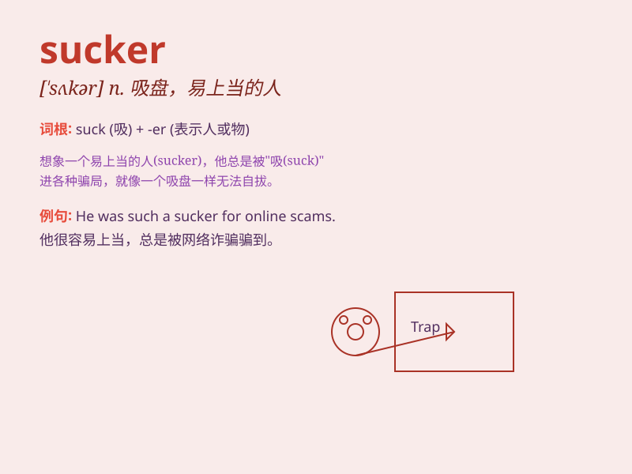

## sucker

**英音:** _[\'sʌkə]_ **美音:** _[\'sʌkɚ]_

**译义:** *n.乳儿,吸管*

### 短语

+ **sucker punch:** _出其不意的猛击_

+ **sucker for:** _对\...\...着迷；很容易被\...\...骗_

+ **little sucker:** _小家伙_

+ **sucker rod:** _抽油杆_

+ **sucker fish:** _吸盘鱼_

### 例句

#### 例句1

> **I\'m such a sucker for chocolate.**

**中文翻译:** 我真是个巧克力迷。

**单词释义:** 对\...\...着迷的人；容易上当的人

#### 例句2

> **Those plants have suckers that attach to the wall.**

**中文翻译:** 这些植物有吸盘附着在墙上。

**单词释义:** 吸根；吸管

#### 例句3

> **Don\'t be a sucker and fall for his tricks.**

**中文翻译:** 不要傻了，被他的诡计所欺骗。

**单词释义:** 容易上当的人

### 背诵小故事

> A little fish was swimming happily in the ocean. One day, it saw a
shiny object and thought it was food. But when it bit, it realized it
was a sucker and got stuck. Poor little fish!

**一条小鱼在海洋里快乐地游着。有一天，它看到一个闪闪发光的东西，以为是食物。但当它咬上去时，才发现那是个吸盘，然后就被卡住了。可怜的小鱼！**

### 图义

