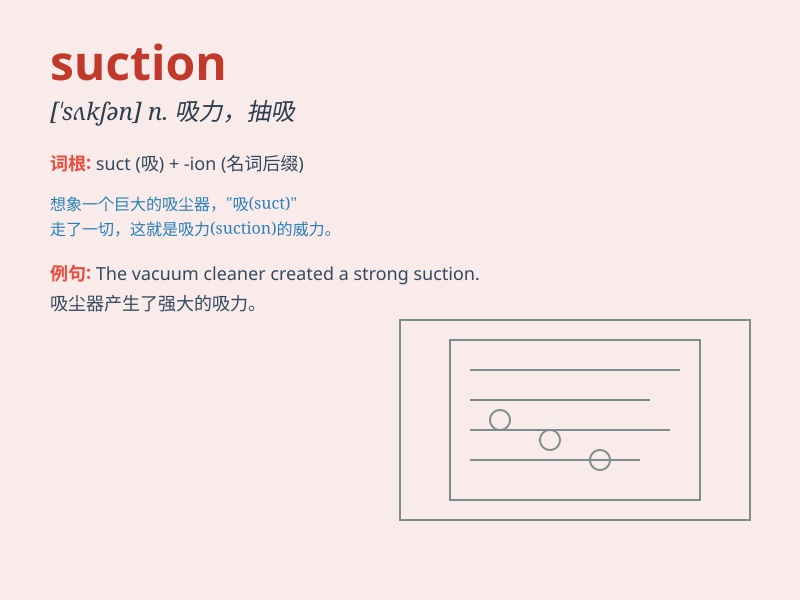

## suction

**英音:** _[\'sʌkʃ(ə)n]_ **美音:** _[\'sʌkʃən]_

**译义:** *n.吸入,吸力,抽气,抽气机,抽水泵,吸引*

### 短语

+ **suction cup:** _吸盘_

+ **suction pump:** _真空泵；抽气泵_

+ **suction force:** _吸力；抽力_

+ **suction device:** _抽吸装置；吸气装置_

+ **suction nozzle:** _吸嘴；吸管嘴_

### 例句

#### 例句1

> **The doctor used a suction device to remove the fluid from the
wound.**

**中文翻译:** 医生使用抽吸装置清除伤口中的液体。

**单词释义:** 吸引；抽吸

#### 例句2

> **The suction of the vacuum cleaner is very powerful.**

**中文翻译:** 吸尘器的吸力非常强大。

**单词释义:** 吸力

#### 例句3

> **The suction cup stuck firmly to the smooth surface.**

**中文翻译:** 吸盘牢牢地粘在光滑的表面上。

**单词释义:** 吸；吸附

### 背诵小故事

> A little bug was stuck in the mud. A kind fairy used suction magic to
pull it out. The bug was saved. Suction means the act of drawing
something in by creating a vacuum.

**一只小虫子被困在泥里。一位善良的仙女用吸力魔法把它拉了出来。小虫子得救了。Suction
意思是通过制造真空来吸入某物的行为。**

### 图义

