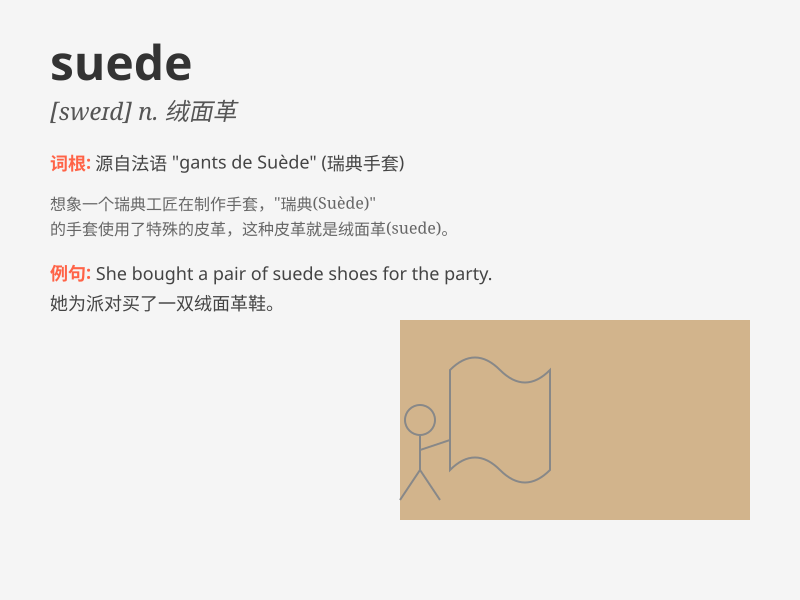

## suede

**英音:** _[sweɪd]_ **美音:** _[swed]_

**译义:** *n.小山羊皮*

### 短语

+ **suede jacket:** _仿麂皮夹克_

+ **suede shoes:** _麂皮鞋_

+ **suede fabric:** _仿麂皮织物_

+ **soft suede:** _柔软的仿麂皮_

+ **suede gloves:** _仿麂皮手套_

### 例句

#### 例句1

> **I bought a pair of suede shoes yesterday.**

**中文翻译:** 我昨天买了一双麂皮鞋。

**单词释义:** 绒面革

#### 例句2

> **The suede jacket is very fashionable this year.**

**中文翻译:** 麂皮外套今年很流行。

**单词释义:** 绒面革

#### 例句3

> **She touched the suede fabric gently.**

**中文翻译:** 她轻轻触碰绒面革面料。

**单词释义:** 绒面织物

### 背诵小故事

> One day, I went to a shoe store and saw a pair of shoes made of
suede. The soft and smooth texture caught my eye. I touched it gently
and decided to buy them. Now, whenever I see those shoes, I remember the
word \'suede\'.

**有一天，我去鞋店看到一双用麂皮（suede）做的鞋。那柔软光滑的质地吸引了我的目光。我轻轻摸了摸，然后决定买下来。现在，每当我看到那双鞋，我就会想起"麂皮"这个词。**

### 图义

