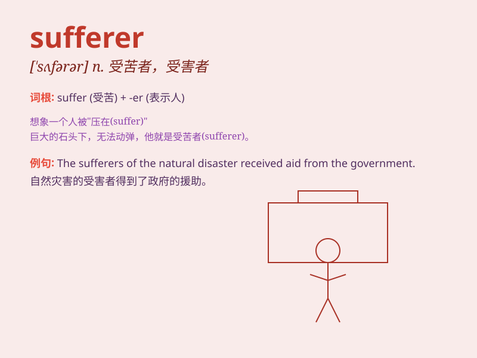

## sufferer

**英音:** _[\'sʌfərə]_ **美音:** _[\'sʌfərɚ]_

**译义:** *n.受害者*

### 短语

+ **chronic sufferer:** _慢性病患者_

+ **cancer sufferer:** _癌症患者_

+ **mental sufferer:** _精神疾病患者_

+ **frequent sufferer:** _经常患病者_

+ **terminal illness sufferer:** _绝症患者_

### 例句

#### 例句1

> **The sufferer of the disease has been in great pain for
months.**

**中文翻译:** 几个月来，这种疾病的患者一直承受着巨大的痛苦。

**单词释义:** 患者

#### 例句2

> **The earthquake left many sufferers without a home.**

**中文翻译:** 地震导致许多灾民无家可归。

**单词释义:** 受难者

#### 例句3

> **She is a sufferer of chronic migraines.**

**中文翻译:** 她是一名慢性偏头痛患者。

**单词释义:** 患者

### 背诵小故事

> A poor man was constantly in pain and facing difficulties. He was a
sufferer. But he never gave up, always trying to find a way out of his
hardships.

**一个可怜的男人总是处于痛苦之中，面临重重困难。他就是一个受难者。但他从不放弃，总是试图找到摆脱困境的方法。**

### 图义

