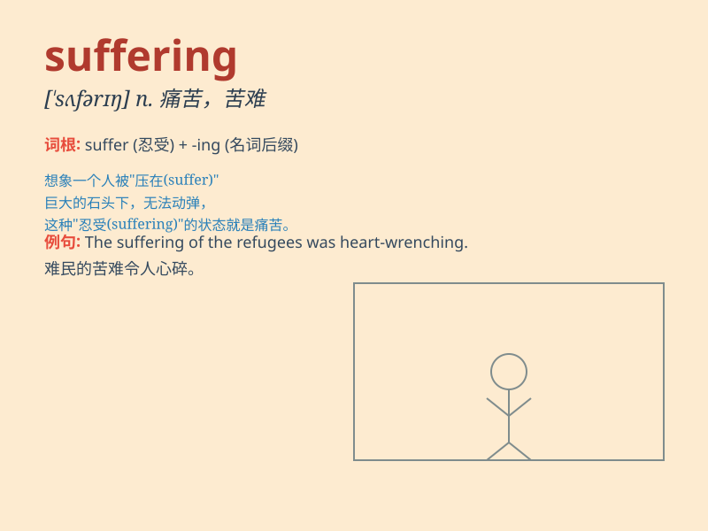

## suffering

**英音:** _[\'sʌf(ə)rɪŋ]_ **美音:** _[\'sʌfərɪŋ]_

**译义:** *n.苦楚,受难adj.受苦的,患病的*

### 短语

+ **suffering from:** _患有；受\...之苦_

+ **mental suffering:** _精神痛苦_

+ **physical suffering:** _身体上的痛苦_

+ **endless suffering:** _无尽的痛苦_

+ **intense suffering:** _强烈的痛苦_

### 例句

#### 例句1

> **The patient was in great suffering due to the severe illness.**

**中文翻译:** 由于病情严重，患者承受着巨大的痛苦。

**单词释义:** 痛苦；苦难

#### 例句2

> **She couldn\'t bear the suffering of losing her child.**

**中文翻译:** 她无法承受失去孩子的痛苦。

**单词释义:** 痛苦；折磨

#### 例句3

> **The war has brought endless suffering to the people.**

**中文翻译:** 战争给人民带来了无尽的痛苦。

**单词释义:** 苦难；灾祸

### 背诵小故事

> A brave soldier was captured by the enemy. He endured countless days
of suffering in the dark prison, but his spirit never broke. Finally, he
was rescued and his suffering came to an end.

**一位勇敢的士兵被敌人俘虏了。他在黑暗的监狱里忍受了无数天的痛苦，但他的精神从未崩溃。最后，他被解救了，他的苦难结束了。**

### 图义

