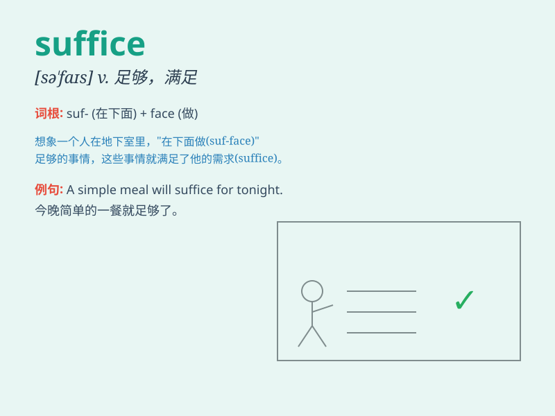

## suffice

**英音:** _[sə\'faɪs]_ **美音:** _[sə\'faɪs]_

**译义:** *vi.足够,有能力vt.使满足*

### 短语

+ **suffice it to say:** _只要说...就够了_

+ **suffice for:** _足够...；满足..._

+ **suffice as:** _充当；足够作为_

+ **suffice oneself with:** _满足于；以...为满足_

+ **suffice to do something:** _足以做某事_

### 例句

#### 例句1

> **One example will suffice to illustrate the point.**

**中文翻译:** 有一个例子就足以说明这一点。

**单词释义:** 足够；足以

#### 例句2

> **A few hours of study should suffice for the exam.**

**中文翻译:** 几个小时的学习应该足以应付考试。

**单词释义:** 足够；满足

#### 例句3

> **In this case, a simple apology may suffice.**

**中文翻译:** 在这种情况下，简单的道歉就足够了。

**单词释义:** 足够；使满足

### 背诵小故事

> A hungry traveler was lost in the forest. He found only a few
berries. They didn\'t look much, but they sufficed to give him some
energy to keep going. \'Suffice\' means to be enough or adequate.

**一位饥饿的旅行者在森林中迷路了。他只找到了几颗浆果。它们看起来不多，但足以给他一些能量继续前行。'suffice'意思是足够或充足。**

### 图义

