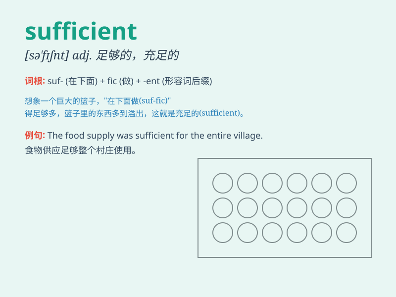

## sufficient

**英音:** _[sə\'fɪʃ(ə)nt]_ **美音:** _[səˈfɪʃənt]_

**译义:** *adj.充分的,足够的*

### 短语

+ **sufficient funds:** _充足的资金_

+ **sufficient evidence:** _充分的证据_

+ **sufficient time:** _足够的时间_

+ **sufficient resources:** _充足的资源_

+ **sufficient quantity:** _足够的数量_

### 例句

#### 例句1

> **We have sufficient food for the party.**

**中文翻译:** 我们有足够的食物供聚会使用。

**单词释义:** 足够的

#### 例句2

> **The salary is not sufficient to support his family.**

**中文翻译:** 工资不足以养家糊口。

**单词释义:** 足够的；充足的

#### 例句3

> **Is two hours sufficient for you to finish the work?**

**中文翻译:** 两个小时足够你完成这项工作吗？

**单词释义:** 足够的；充分的

### 背诵小故事

> A poor man was always hungry. One day, he found a magic bag that
could provide sufficient food. With enough to eat, he was happy and no
longer suffered. Sufficient means enough to meet the needs.

**一个穷人总是挨饿。有一天，他发现了一个神奇的袋子，能提供充足的食物。有了足够吃的，他很开心，不再受苦。Sufficient
意思是足够的，能满足需求的。**

### 图义

