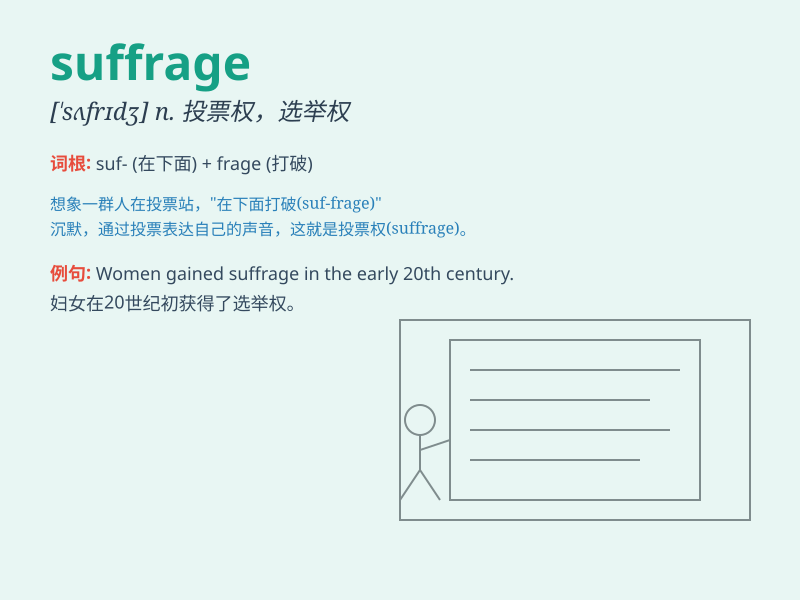

## suffrage

**英音:** _[\'sʌfrɪdʒ]_ **美音:** _[\'sʌfrɪdʒ]_

**译义:** *n.投票,选举权,参政权,[宗]代祷*

### 短语

+ **universal suffrage:** _普选权_

+ **women\'s suffrage:** _妇女选举权_

+ **suffrage movement:** _选举权运动_

+ **limited suffrage:** _有限选举权_

+ **political suffrage:** _政治选举权_

### 例句

#### 例句1

> **The suffrage movement fought for women\'s right to vote.**

**中文翻译:** 选举权运动为妇女的投票权而战。

**单词释义:** 选举权

#### 例句2

> **Universal suffrage is a fundamental principle of democracy.**

**中文翻译:** 普选是民主的基本原则。

**单词释义:** 选举权；投票权

#### 例句3

> **The country has gradually expanded suffrage over the years.**

**中文翻译:** 多年来，该国逐步扩大了选举权。

**单词释义:** 选举权

### 背诵小故事

> A long time ago, in a small town, people fought hard for suffrage.
They wanted the right to vote and have a say in the decisions. Finally,
after many efforts, they achieved suffrage and could shape their future.

**很久以前，在一个小镇上，人们为了选举权而努力抗争。他们想要投票权，在决策中拥有发言权。最终，经过许多努力，他们获得了选举权，可以塑造自己的未来。**

### 图义

