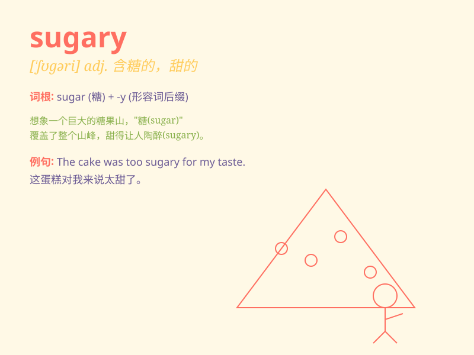

## sugary

**英音:** _[\'ʃʊg(ə)rɪ]_ **美音:** _[\'ʃʊɡəri]_

**译义:** *adj.含糖的,甜的*

### 短语

+ **sugary drink:** _含糖饮料_

+ **sugary snack:** _含糖零食_

+ **sugary cereal:** _含糖谷类食品_

+ **sugary dessert:** _含糖甜点_

+ **sugary treat:** _含糖美食_

### 例句

#### 例句1

> **The cake was too sugary for my taste.**

**中文翻译:** 蛋糕太甜了，不适合我的口味。

**单词释义:** 含糖的；甜的

#### 例句2

> **She avoids sugary drinks to stay healthy.**

**中文翻译:** 为了保持健康，她避免喝含糖饮料。

**单词释义:** 含糖的；甜的

#### 例句3

> **The children love sugary candies.**

**中文翻译:** 孩子们喜欢含糖的糖果。

**单词释义:** 含糖的；甜的

### 背诵小故事

> One day, I went to a candy store. There were all kinds of candies,
which were very sugary. I ate one and felt so sweet. But too much sugary
food is not good for health.

**有一天，我去了一家糖果店。那里有各种各样的糖果，都非常甜。我吃了一颗，感觉特别甜。但太多含糖的食物对健康不好。**

### 图义

