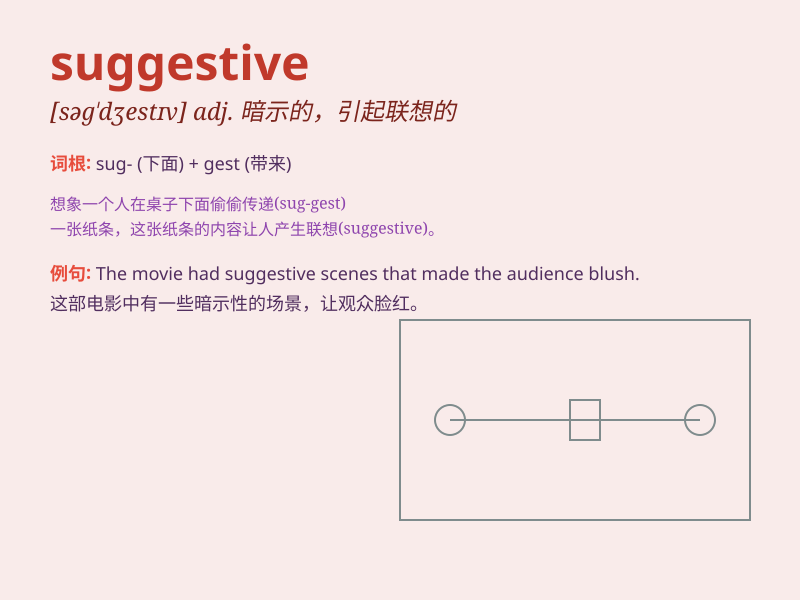

## suggestive

**英音:** _[sə\'dʒestɪv]_ **美音:** _[sə\'dʒɛstɪv]_

**译义:** *adj.提示的,启发的,暗示的*

### 短语

+ **suggestive of:** _使人想起；暗示_

+ **suggestive remarks:** _暗示性的言论_

+ **suggestive evidence:** _暗示性的证据_

+ **suggestive look:** _暗示的眼神_

+ **suggestive gesture:** _暗示性的手势_

### 例句

#### 例句1

> **His behavior was highly suggestive of guilt.**

**中文翻译:** 他的行为高度暗示了他的内疚感。

**单词释义:** 暗示的；引起联想的

#### 例句2

> **The painting has a suggestive theme.**

**中文翻译:** 这幅画有一个暗示性的主题。

**单词释义:** 引起联想的；启发想象的

#### 例句3

> **Her smile was suggestive of a secret.**

**中文翻译:** 她的笑容暗示着一个秘密。

**单词释义:** 暗示的；示意的

### 背诵小故事

> A detective was investigating a crime scene. The mysterious clues
were suggestive of a complex plot. Just as he was about to give up, a
small mark on the wall suggested a hidden passage. This led him to solve
the case.

**一位侦探正在调查犯罪现场。这些神秘的线索暗示着一个复杂的阴谋。就在他即将放弃的时候，墙上的一个小标记暗示着有一个隐藏的通道。这使他破了案。**

### 图义

