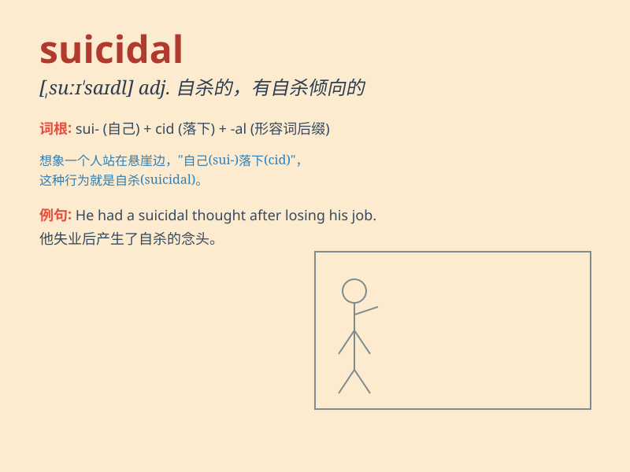

## suicidal

**英音:** _[s(j)uːɪ\'saɪd(ə)l]_ **美音:**
_[\'sʊə\'saɪdl]_

**译义:** *adj.自杀的,自毁的,自取灭亡的*

### 短语

+ **suicidal tendencies:** _自杀倾向_

+ **suicidal thoughts:** _自杀念头_

+ **suicidal behavior:** _自杀行为_

+ **suicidal impulse:** _自杀冲动_

+ **suicidal risk:** _自杀风险_

### 例句

#### 例句1

> **He became suicidal after the loss of his job and the breakdown of
his marriage.**

**中文翻译:** 失业和婚姻破裂后，他产生了自杀倾向。

**单词释义:** 有自杀倾向的

#### 例句2

> **The doctor was concerned about her suicidal thoughts.**

**中文翻译:** 医生担心她的自杀念头。

**单词释义:** 自杀的

#### 例句3

> **Suicidal behavior is a serious problem that requires immediate
attention.**

**中文翻译:** 自杀行为是一个严重的问题，需要立即关注。

**单词释义:** 自杀性的

### 背诵小故事

> A man was in deep depression and had suicidal thoughts. But when he
saw a beautiful rainbow after the rain, he felt hope again. Remember,
suicidal means having the intention to kill oneself.

**一个男人深陷抑郁并有自杀的想法。但当他在雨后看到美丽的彩虹，他再次感受到了希望。记住，suicidal
意思是有自杀倾向的。**

### 图义

