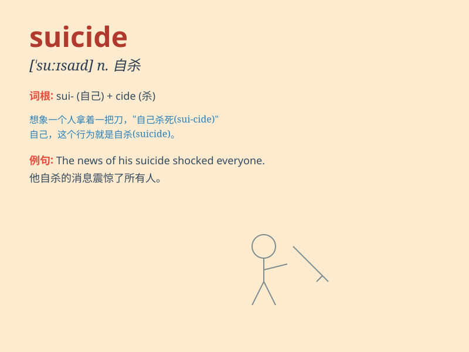

## suicide

**英音:** _[\'s(j)uːɪsaɪd]_ **美音:** _[\'suɪsaɪd]_

**译义:** *n.自杀,自毁,给自己带来伤害或损失的行为*

### 短语

+ **commit suicide:** _自杀_

+ **suicide attempt:** _自杀企图_

+ **suicide note:** _遗书；自杀留言_

+ **suicide bombing:** _自杀式爆炸_

+ **suicide prevention:** _预防自杀_

### 例句

#### 例句1

> **He attempted suicide several times but was fortunately saved each
time.**

**中文翻译:** 他曾多次试图自杀，但幸运的是每次都被救了。

**单词释义:** 自杀

#### 例句2

> **Suicide is a serious social issue that requires attention and
prevention.**

**中文翻译:** 自杀是一个严重的社会问题，需要引起重视和预防。

**单词释义:** 自杀

#### 例句3

> **The police are investigating a suspected suicide case.**

**中文翻译:** 警方正在调查一起疑似自杀案件。

**单词释义:** 自杀

### 背诵小故事

> A man was in deep pain and felt there was no hope. One dark night, he
decided to take his own life, which is called suicide. But remember,
life is precious and there\'s always a way out.

**一个男人深陷痛苦，觉得毫无希望。在一个漆黑的夜晚，他决定结束自己的生命，这就叫做自杀。但要记住，生命宝贵，总有出路。**

### 图义

