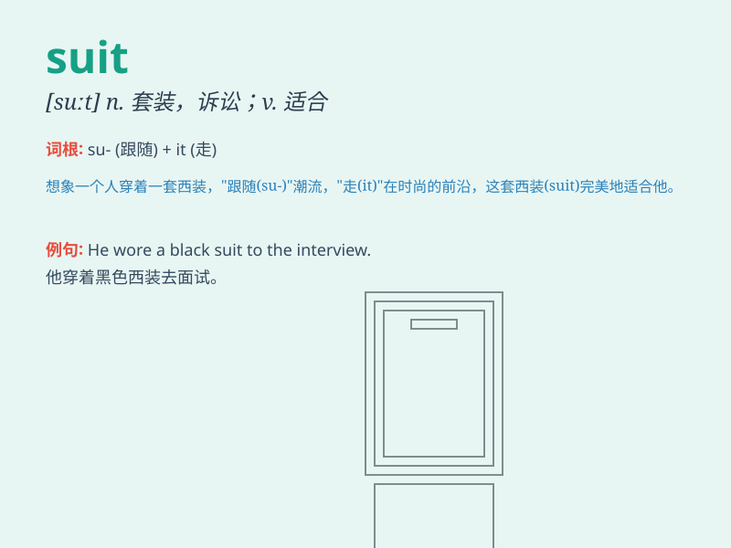

## suit

**英音:** _[sju:t; su:t]_ **美音:** _[sut]_

**译义:** *v.合适,适合,相配,合式,适宜于n.一套衣服*

### 短语

+ **suit oneself:** _随自己的意愿行事_

+ **follow suit:** _跟着做；仿效_

+ **a suit of clothes:** _一套衣服_

+ **bathing suit:** _游泳衣_

+ **space suit:** _航天服；宇航服_

### 例句

#### 例句1

> **This suit looks very stylish.**

**中文翻译:** 这套衣服看起来非常时尚。

**单词释义:** 西装

#### 例句2

> **The color of the dress suits you well.**

**中文翻译:** 这件衣服的颜色很适合你。

**单词释义:** 适合

#### 例句3

> **He decided to sue the company to get justice for the unfair
treatment that didn\'t suit the law.**

**中文翻译:**
他决定起诉该公司，为不符合法律规定的不公平待遇讨回公道。

**单词释义:** 符合

### 背诵小故事

> A man went to a party. He had many clothes in his closet. But only
one suit fit the theme of the party perfectly. So he wore that suit and
had a great time.

**一个男人去参加聚会。他的衣橱里有很多衣服。但只有一套西装完全符合聚会的主题。所以他穿上了那套西装，度过了一段美好的时光。**

### 图义

