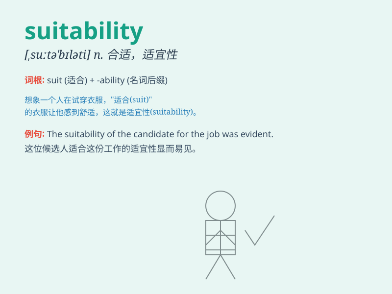

## suitability

**英音:** _[,su:tə\'bɪlətɪ]_ **美音:** _[sʊtə\'bɪləti]_

**译义:** *n.合适,适当,相配,适宜性*

### 短语

+ **assess suitability:** _评估适用性_

+ **determine suitability:** _确定合适性_

+ **consider suitability:** _考虑适合度_

+ **enhance suitability:** _提高适用性_

+ **examine suitability:** _检查合适性_

### 例句

#### 例句1

> **The suitability of this dress for the party depends on the
theme.**

**中文翻译:** 这件衣服是否适合聚会取决于主题。

**单词释义:** 合适性；适宜性

#### 例句2

> **We need to assess the suitability of the candidate for the
job.**

**中文翻译:** 我们需要评估候选人是否适合该职位。

**单词释义:** 适合性；适当性

#### 例句3

> **The suitability of the location for the new factory was carefully
considered.**

**中文翻译:** 新工厂选址的适宜性经过了仔细考虑。

**单词释义:** 适宜性；合适性

### 背诵小故事

> Once upon a time, a prince was looking for a suitable partner. He
evaluated many girls based on their suitability. Finally, he found the
one who was most suitable for him. That\'s how he understood the meaning
of suitability.

**从前，有一位王子正在寻找合适的伴侣。他根据女孩们的适合度来评估。最终，他找到了最适合他的那个人。这就是他如何理解了suitability（适合性）这个词的意思。**

### 图义

