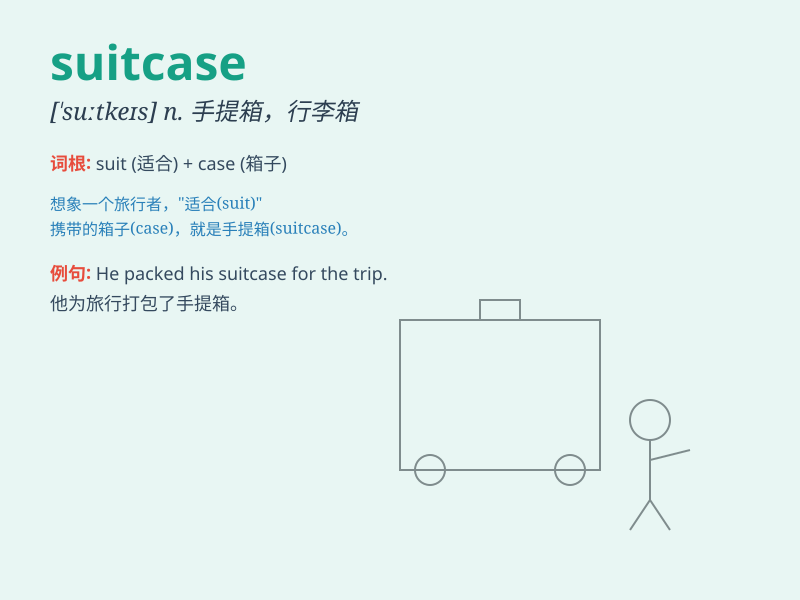

## suitcase

**英音:** _[\'suːtkeɪs]_ **美音:** _[\'sutkes]_

**译义:** *n.手提箱,衣箱*

### 短语

+ **carry a suitcase:** _携带一个手提箱_

+ **pack a suitcase:** _收拾手提箱_

+ **open a suitcase:** _打开手提箱_

+ **heavy suitcase:** _沉重的手提箱_

+ **lost suitcase:** _丢失的手提箱_

### 例句

#### 例句1

> **I packed my clothes into the suitcase.**

**中文翻译:** 我把衣服装进了行李箱。

**单词释义:** 手提箱

#### 例句2

> **She struggled to carry the heavy suitcase up the stairs.**

**中文翻译:** 她费力地拎着沉重的行李箱上了楼。

**单词释义:** 手提箱

#### 例句3

> **The suitcase was lost during the flight.**

**中文翻译:** 行李箱在飞行过程中丢失。

**单词释义:** 手提箱

### 背诵小故事

> One day, Tom was going on a trip. He packed all his clothes and
necessities into a suitcase. But the suitcase was so heavy that he
struggled to carry it. Finally, with great effort, he got it onto the
train.

**一天，汤姆要去旅行。他把所有的衣服和必需品都装进了一个手提箱。但手提箱太重了，他费力地提着。最后，费了好大劲，他才把它搬上了火车。**

### 图义

