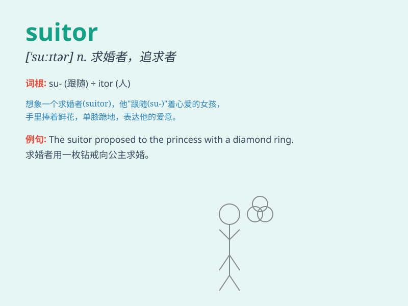

## suitor

**英音:** _[\'suːtə]_ **美音:** _[\'sʊtɚ]_

**译义:** *n.起诉者,求婚者,请愿者*

### 短语

+ **potential suitor:** _潜在的追求者_

+ **eligible suitor:** _合格的求婚者_

+ **wealthy suitor:** _富有的追求者_

+ **persistent suitor:** _坚持不懈的追求者_

+ **secret suitor:** _秘密的追求者_

### 例句

#### 例句1

> **She had many suitors vying for her attention.**

**中文翻译:** 她有许多追求者争夺她的注意力。

**单词释义:** 追求者

#### 例句2

> **The rich heiress was constantly bothered by persistent
suitors.**

**中文翻译:** 这位富有的女继承人经常受到执着的追求者的困扰。

**单词释义:** 追求者

#### 例句3

> **He proved to be a sincere suitor and won her heart.**

**中文翻译:** 事实证明，他是一个真诚的追求者，赢得了她的心。

**单词释义:** 追求者

### 背诵小故事

> A beautiful princess had many suitors. One suitor brought her flowers
every day. Another sang love songs for her. But in the end, she chose
the suitor who was kind and brave.

**一位美丽的公主有许多求婚者。一个求婚者每天给她送花。另一个为她唱情歌。但最后，她选择了那个善良勇敢的求婚者。**

### 图义

