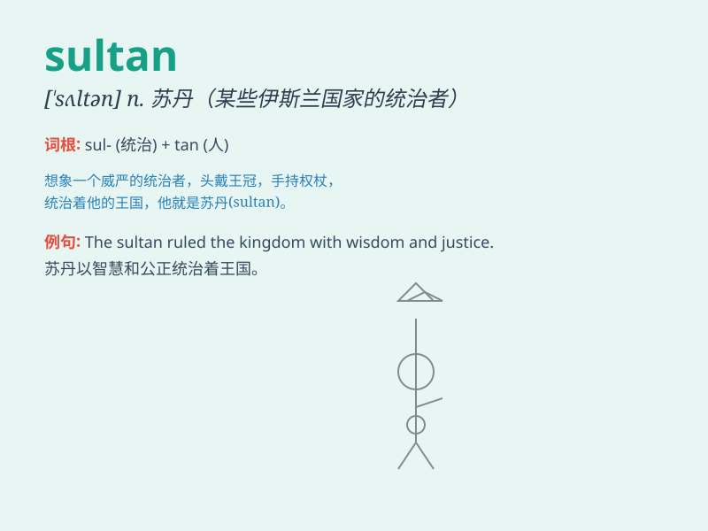

## sultan

**英音:** _[\'sʌlt(ə)n]_ **美音:** _[\'sʌltən]_

**译义:** * n苏丹(某些伊斯兰国家最高统治者的称号)*

### 短语

+ **Sultan of Swing:** _摇摆之王_

+ **Sultan Ahmed Mosque:** _苏丹艾哈迈德清真寺_

+ **Grand Sultan:** _大苏丹_

+ **Sultan Qaboos:** _苏丹卡布斯_

+ **Sultan Palace:** _苏丹宫殿_

### 例句

#### 例句1

> **The sultan ruled the kingdom with wisdom and fairness.**

**中文翻译:** 苏丹以智慧和公平统治王国。

**单词释义:** 苏丹（指某个王国的统治者）

#### 例句2

> **The sultan\'s palace was a magnificent sight to behold.**

**中文翻译:** 苏丹的宫殿非常壮观。

**单词释义:** 苏丹

#### 例句3

> **The sultan received foreign dignitaries with great ceremony.**

**中文翻译:** 苏丹以隆重的仪式接见了外国政要。

**单词释义:** 苏丹

### 背诵小故事

> Once upon a time, in a faraway land, there was a powerful leader
named Sultan. He ruled with wisdom and kindness. Everyone respected him.
The word \'sultan\' reminds us of this great and respected leader.

**从前，在一个遥远的地方，有一位强大的领袖叫苏丹。他以智慧和仁慈统治。每个人都尊敬他。"sultan"这个单词让我们想起这位伟大且受尊敬的领袖。**

### 图义

