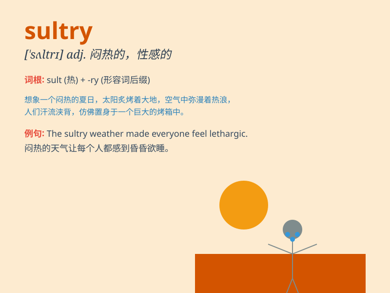

## sultry

**英音:** _[\'sʌltrɪ]_ **美音:** _[\'sʌltri]_

**译义:** *adj.闷热的,粗暴的,激烈的,放荡的*

### 短语

+ **sultry weather:** _闷热的天气_

+ **sultry summer:** _闷热的夏天_

+ **sultry afternoon:** _闷热的下午_

+ **sultry wind:** _闷热的风_

+ **sultry night:** _闷热的夜晚_

### 例句

#### 例句1

> **The sultry weather made it difficult to sleep.**

**中文翻译:** 闷热的天气让人难以入睡。

**单词释义:** 闷热的

#### 例句2

> **She gave him a sultry look.**

**中文翻译:** 她给了他一个性感的眼神。

**单词释义:** 性感迷人的

#### 例句3

> **The sultry summer afternoon was oppressive.**

**中文翻译:** 夏日的午后闷热难受。

**单词释义:** 闷热的

### 背诵小故事

> 在一个炎热的夏日，小明走在街头，天气 sultry
得让人难以忍受。他汗流浃背，仿佛置身于一个巨大的蒸笼中。这时，他看到一家冷饮店，迫不及待地冲进去享受片刻的清凉。

**在一个炎热的夏日，小明走在街头，天气闷热得让人难以忍受。他汗流浃背，仿佛置身于一个巨大的蒸笼中。这时，他看到一家冷饮店，迫不及待地冲进去享受片刻的清凉。**

### 图义

