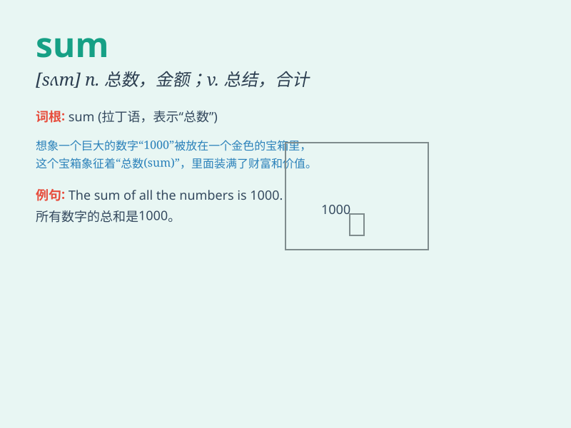

## sum

**英音:** _[sʌm]_ **美音:** _[sʌm]_

**译义:** *n.总数,和,金额,算术题*

### 短语

+ **in sum:** _总之；总而言之_

+ **sum up:** _总结；概括_

+ **sum total:** _总数；总和_

+ **a large sum of:** _一大笔......_

+ **the sum of:** _......的总和_

### 例句

#### 例句1

> **The sum of 2 and 3 is 5.**

**中文翻译:** 2 和 3 的和是 5。

**单词释义:** 总和；总数

#### 例句2

> **She quickly did the sum in her head.**

**中文翻译:** 她很快在心里算了一笔账。

**单词释义:** 总数；算术题

#### 例句3

> **The sum of their efforts was a great success.**

**中文翻译:** 他们的努力总和取得了巨大的成功。

**单词释义:** 总和；全部

### 背诵小故事

> 想象一个数学天才小明，他每次参加数学竞赛，总能迅速算出一堆数字的
SUM（总和）。有一次，老师给出了 10 个数，小明轻松得出 SUM 并赢得比赛。

**想象一个叫小明的数学天才，他在数学竞赛中总能快速算出一堆数字的总和。有一次，老师给出
10 个数，小明轻松得出总和并赢得比赛。**

### 图义

