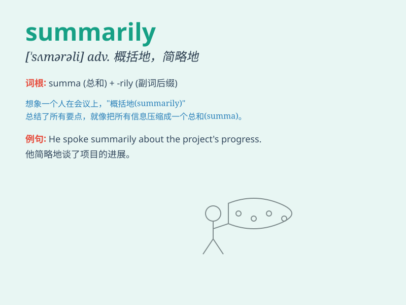

## summarily

**英音:** _[\'sʌmərəli]_ **美音:** _[\'sʌmərəli]_

**译义:** *adv.概要地,概略地,立刻,草率地*

### 短语

+ **summarily dismissed:** _立即被解雇_

+ **summarily executed:** _立即被处决_

+ **summarily rejected:** _立即被拒绝_

+ **summarily dealt with:** _立即处理_

+ **summarily punished:** _立即受到惩罚_

### 例句

#### 例句1

> **The employee was summarily dismissed for misconduct.**

**中文翻译:** 该员工因不当行为被立即解雇。

**单词释义:** 立即地；简单地

#### 例句2

> **The proposal was summarily rejected without further
consideration.**

**中文翻译:** 该提议未经进一步考虑就被立即拒绝。

**单词释义:** 立即地；草率地

#### 例句3

> **The case was summarily dealt with by the judge.**

**中文翻译:** 法官对案件进行了简易审理。

**单词释义:** 迅速地；概要地

### 背诵小故事

> A detective was solving a case. The suspect was caught and judged
summarily. Without much detailed investigation, justice was delivered
quickly. But later, new evidence emerged, showing the hasty decision.

**一位侦探在侦破一个案件。嫌疑人被迅速抓获并即刻裁决。没有太多详细的调查，正义就迅速降临。但后来，新的证据出现了，表明这是个仓促的决定。**

### 图义

