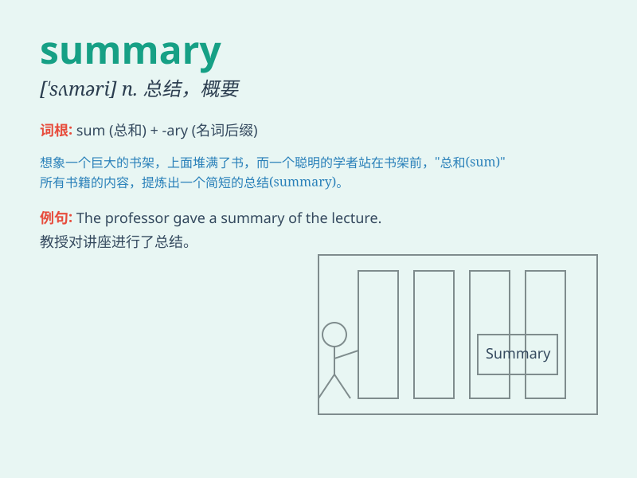

## summary

**英音:** _[\'sʌm(ə)rɪ]_ **美音:** _[\'sʌməri]_

**译义:** *n.摘要,概要*

### 短语

+ **summary account:** _汇总账户_

+ **summary statement:** _汇总报表_

+ **in summary:** _总之；概括起来_

+ **summary report:** _总结报告_

+ **executive summary:** _执行摘要；行政摘要_

### 例句

#### 例句1

> **The summary of the book was very helpful.**

**中文翻译:** 这本书的总结非常有帮助。

**单词释义:** 摘要；概要

#### 例句2

> **Can you give me a summary of the meeting?**

**中文翻译:** 你能给我总结一下会议的情况吗？

**单词释义:** 总结；概括

#### 例句3

> **In summary, we need to work harder.**

**中文翻译:** 总而言之，我们需要更加努力。

**单词释义:** 总之；概括起来

### 背诵小故事

> A student was very busy and had many tasks. But before the exam, she
made a summary of all the key points. With this summary, she passed the
exam easily.

**一名学生非常忙碌，有很多任务。但在考试前，她对所有重点做了一个总结。凭借这个总结，她轻松通过了考试。**

### 图义

