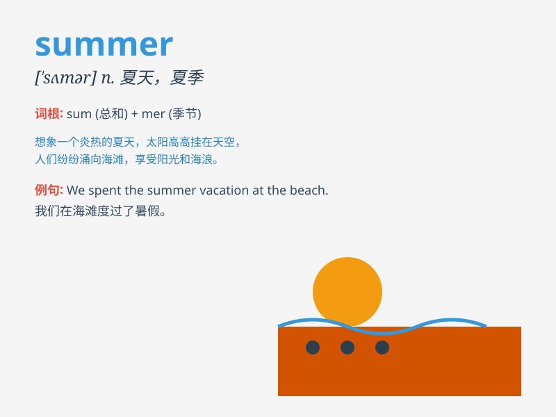

## summer

**英音:** _[\'sʌmə]_ **美音:** _[\'sʌmɚ]_

**译义:** *n.夏季vi.避暑,过夏天adj.夏季的,在夏季的*

### 短语

+ **summer vacation:** _暑假_

+ **summer camp:** _夏令营_

+ **summer solstice:** _夏至_

+ **high summer:** _盛夏；仲夏_

+ **Indian summer:** _（深秋初冬的）小阳春；（老年的）回春期_

### 例句

#### 例句1

> **I love going to the beach in summer.**

**中文翻译:** 我喜欢夏天去海滩。

**单词释义:** 夏天

#### 例句2

> **Summer is the hottest season of the year.**

**中文翻译:** 夏季是一年中最热的季节。

**单词释义:** 夏天

#### 例句3

> **We had a wonderful summer vacation.**

**中文翻译:** 我们度过了一个美好的暑假。

**单词释义:** 夏天；夏季

### 背诵小故事

> In summer, a little girl went to the beach. She built sandcastles,
swam in the sea, and ate ice cream. The sun was bright and warm. It was
a wonderful time for her.

**在夏天，一个小女孩去了海滩。她堆沙堡、在海里游泳、吃冰淇淋。太阳明亮又温暖。对她来说这是一段美好的时光。**

### 图义

