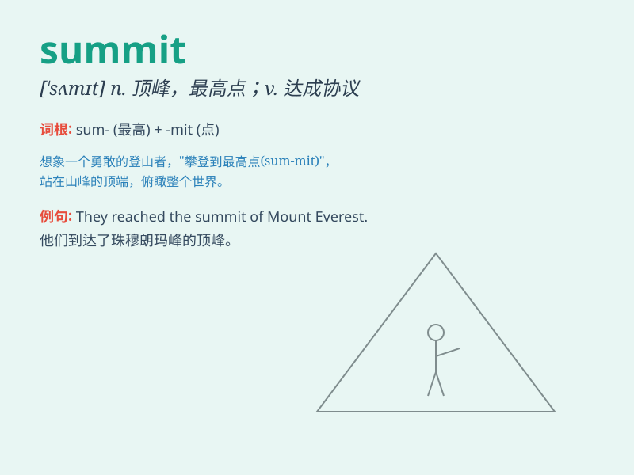

## summit

**英音:** _[\'sʌmɪt]_ **美音:** _[\'sʌmɪt]_

**译义:** *n.顶点,最高阶层adj.政府首脑的vi.参加最高级会议的*

### 短语

+ **summit meeting:** _首脑会议；峰会_

+ **reach the summit:** _到达山顶_

+ **summit conference:** _高峰会议_

+ **summit negotiations:** _峰会谈判_

+ **at the summit:** _在山顶；在峰会_

### 例句

#### 例句1

> **The leaders met at the summit to discuss global issues.**

**中文翻译:** 领导人在峰会上会面讨论全球问题。

**单词释义:** 峰会；顶点

#### 例句2

> **She finally reached the summit of her career.**

**中文翻译:** 她终于达到了事业的顶峰。

**单词释义:** 巅峰；顶点

#### 例句3

> **The mountain climbers struggled to reach the summit.**

**中文翻译:** 登山队员们奋力登顶。

**单词释义:** 山顶

### 背诵小故事

> A brave climber struggled through harsh conditions to reach the
summit of the mountain. At the summit, he saw a breathtaking view that
made all his efforts worthwhile. The summit was the ultimate goal and
the peak of his adventure.

**一位勇敢的登山者在恶劣的条件下奋力攀登，终于到达了山顶。在山顶，他看到了令人惊叹的景色，这让他所有的努力都值得了。山顶是他冒险的终极目标和巅峰。**

### 图义

