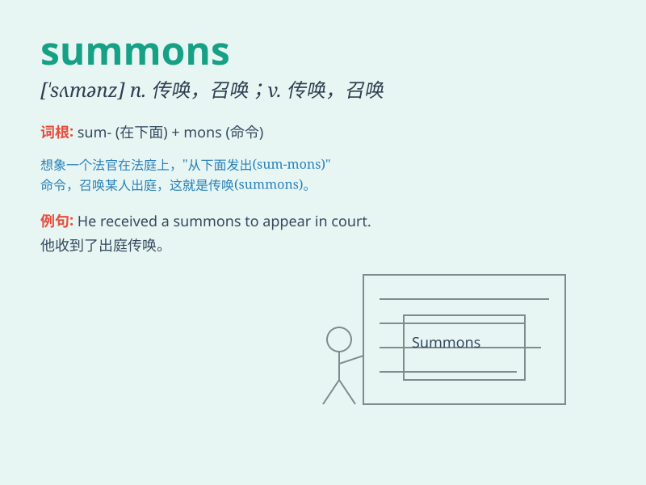

## summons

**英音:** _[\'sʌm(ə)nz]_ **美音:** _[\'sʌmənz]_

**译义:** *n.召唤,[律]传唤,召集,传票vt.传唤到法院,唤出,传到*

### 短语

+ **summons to court:** _法院传票_

+ **issue a summons:** _发出传票_

+ **obey a summons:** _服从传票_

+ **summons for jury duty:** _陪审团义务传票_

+ **summons of witnesses:** _证人传票_

### 例句

#### 例句1

> **He received a summons to appear in court.**

**中文翻译:** 他收到出庭传票。

**单词释义:** 传票

#### 例句2

> **The police issued a summons for speeding.**

**中文翻译:** 警方因超速行驶而发出传票。

**单词释义:** 传票

#### 例句3

> **The summons commanded her to attend the meeting.**

**中文翻译:** 传票命令她出席会议。

**单词释义:** 传票；命令

### 背诵小故事

> One day, a brave knight received a summons. It was a call to go to
the king\'s castle and help defend the kingdom. The summons was a
serious and urgent request that couldn\'t be ignored.

**有一天，一位勇敢的骑士收到了一份传票。这是一个前往国王城堡并帮助保卫王国的召唤。传票是一个严肃且紧急的请求，不容忽视。**

### 图义

