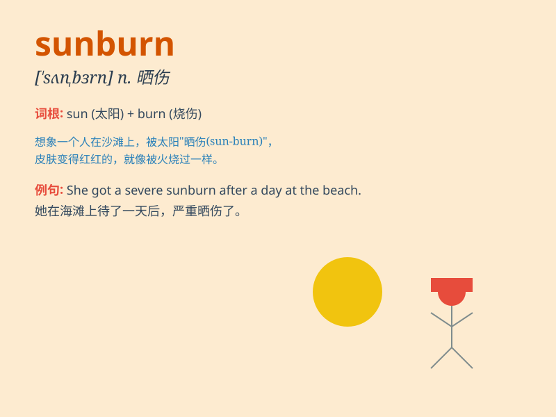

## sunburn

**英音:** _[\'sʌnbɜːn]_ **美音:** _[\'sʌn\'bɝn]_

**译义:** *n.晒斑,晒黑*

### 短语

+ **get sunburn:** _晒伤_

+ **prevent sunburn:** _预防晒伤_

+ **suffer from sunburn:** _遭受晒伤_

+ **severe sunburn:** _严重的晒伤_

+ **minor sunburn:** _轻微的晒伤_

### 例句

#### 例句1

> **I got a bad sunburn after spending the whole day at the
beach.**

**中文翻译:** 在海滩度过一整天后，我被严重晒伤了。

**单词释义:** 晒伤

#### 例句2

> **She applied sunscreen to prevent sunburn.**

**中文翻译:** 她涂了防晒霜以防止晒伤。

**单词释义:** 晒伤

#### 例句3

> **His face was red from sunburn.**

**中文翻译:** 他的脸被晒红了。

**单词释义:** 晒伤

### 背诵小故事

> One hot summer day, Tom went to the beach without sunscreen. He
played in the sun for hours and got a bad sunburn. His skin turned red
and painful. From then on, he always remembered to protect himself from
sunburn.

**在一个炎热的夏日，汤姆去海滩没涂防晒霜。他在太阳下玩了几个小时，严重晒伤了。他的皮肤变得又红又疼。从那以后，他总是记得保护自己不被晒伤。**

### 图义

