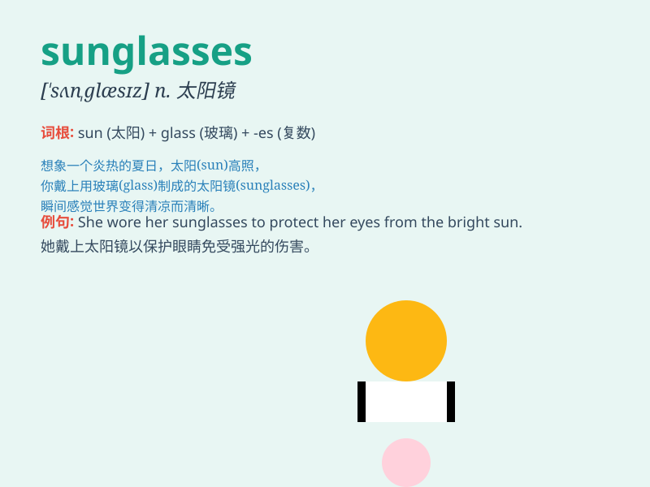

## sunglasses

**英音:** _[sʌnɡlɑːsɪz]_ **美音:** _[sʌnɡlæsɪz]_

**译义:** *n.太阳镜，墨镜*

### 短语

+ **wear sunglasses:** _戴太阳镜_

+ **pair of sunglasses:** _一副太阳镜_

+ **designer sunglasses:** _名牌太阳镜_

+ **polarized sunglasses:** _偏光太阳镜_

+ **sports sunglasses:** _运动太阳镜_

### 例句

#### 例句1

> **She put on her sunglasses to protect her eyes from the bright
sun.**

**中文翻译:** 她戴上太阳镜以保护眼睛免受强烈阳光的伤害。

**单词释义:** 太阳镜

#### 例句2

> **His sunglasses made him look very cool.**

**中文翻译:** 他的太阳镜让他看起来很酷。

**单词释义:** 太阳镜

#### 例句3

> **I lost my sunglasses on the beach yesterday.**

**中文翻译:** 昨天我在海滩上把我的太阳镜弄丢了。

**单词释义:** 太阳镜

### 背诵小故事

> One sunny day, I was walking on the beach. The sun was so bright that
it hurt my eyes. Then, a kind stranger gave me a pair of sunglasses.
They protected my eyes and made everything look cooler. Now I always
remember \'sunglasses\' as my savior from the bright sun.

**在一个阳光明媚的日子，我走在沙滩上。太阳太刺眼以至于伤了我的眼睛。然后，一个善良的陌生人给了我一副太阳镜。它们保护了我的眼睛，让一切看起来更酷。现在我总是把"太阳镜"当作是我免受烈日伤害的救星。**

### 图义

