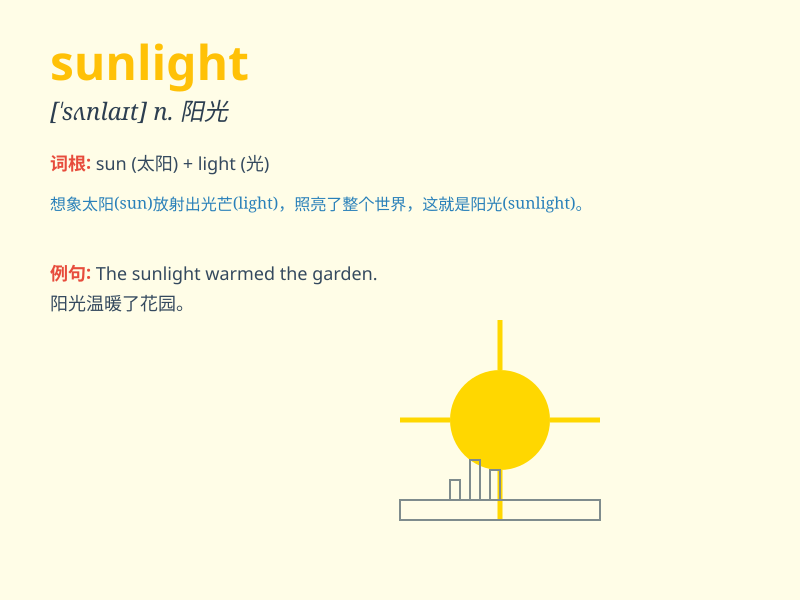

## sunlight

**英音:** _[\'sʌnlaɪt]_ **美音:** _[\'sʌnlaɪt]_

**译义:** *n.日光,阳光,日照*

### 短语

+ **bright sunlight:** _明亮的阳光_

+ **direct sunlight:** _直射的阳光_

+ **warm sunlight:** _温暖的阳光_

+ **filtered sunlight:** _过滤后的阳光_

+ **intense sunlight:** _强烈的阳光_

### 例句

#### 例句1

> **The plants need plenty of sunlight to grow.**

**中文翻译:** 这些植物需要充足的阳光才能生长。

**单词释义:** 阳光

#### 例句2

> **She sat in the sunlight, reading a book.**

**中文翻译:** 她坐在阳光下，看书。

**单词释义:** 阳光

#### 例句3

> **The sunlight filtered through the leaves.**

**中文翻译:** 阳光透过树叶照进来。

**单词释义:** 阳光

### 背诵小故事

> One day, a little seed was buried in the soil. It was very dark. But
then, the warm sunlight came through. The seed felt the power and grew
up happily. The sunlight gave it hope and life.

**有一天，一粒小种子被埋在土里。里面非常黑暗。但随后，温暖的阳光照了进来。种子感受到了力量，快乐地生长。阳光给了它希望和生命。**

### 图义

