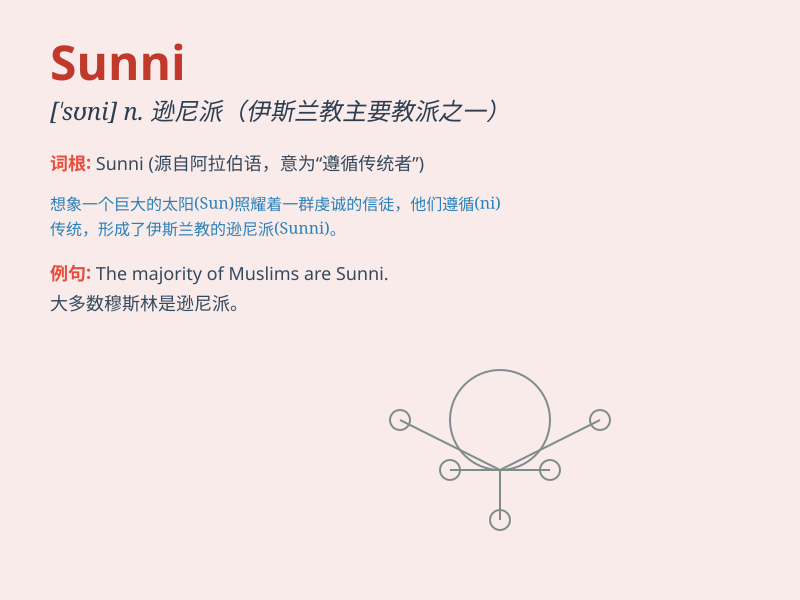

## Sunni

**英音:** _[ˈsʊni]_ **美音:** _[ˈsʊni]_

**译义:** *n. 逊尼派穆斯林（伊斯兰教主要教派之一，与什叶派相对）*

### 短语

+ **Sunni Islam:** _逊尼派伊斯兰教_

+ **Sunni majority:** _逊尼派多数_

+ **Sunni community:** _逊尼派社区_

+ **Sunni sect:** _逊尼派教派_

+ **Sunni tradition:** _逊尼派传统_

### 例句

#### 例句1

> **The majority of the population in this region are Sunni
Muslims.**

**中文翻译:** 这个地区的大多数人口是逊尼派穆斯林。

**单词释义:** 逊尼派（的）

#### 例句2

> **Sunni and Shia have different religious beliefs and
practices.**

**中文翻译:** 逊尼派和什叶派有着不同的宗教信仰和实践。

**单词释义:** 逊尼派（的）

#### 例句3

> **The conflict between Sunni and Shia has a long history.**

**中文翻译:** 逊尼派和什叶派之间的冲突有着悠久的历史。

**单词释义:** 逊尼派（的）

### 背诵小故事

> Once upon a time, there was a group of people called Sunni. They had
their own beliefs and traditions. They were like a big family, united by
their shared values. Remember, Sunni represents a specific religious
group.

**从前，有一群人被称为逊尼派。他们有自己的信仰和传统。他们就像一个大家庭，因共同的价值观而团结在一起。记住，逊尼派代表了一个特定的宗教群体。**

### 图义

