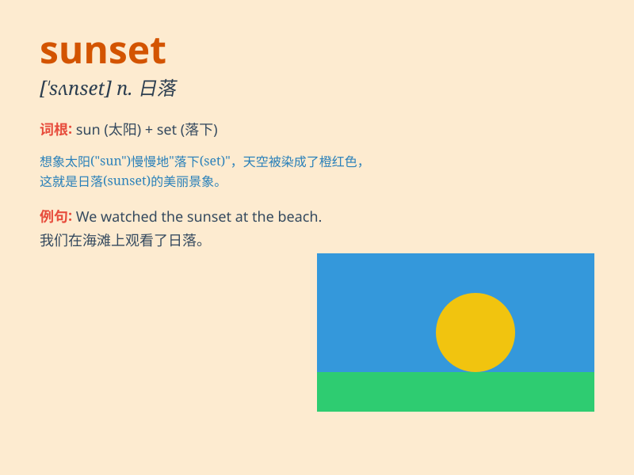

## sunset

**英音:** _[\'sʌnset]_ **美音:** _[\'sʌnsɛt]_

**译义:** *n.日落,晚年*

### 短语

+ **at sunset:** _在日落时_

+ **sunset glow:** _晚霞_

+ **sunset industry:** _夕阳产业_

+ **before sunset:** _日落之前_

+ **sunset view:** _日落景色_

### 例句

#### 例句1

> **We sat on the beach and watched the beautiful sunset.**

**中文翻译:** 我们坐在沙滩上看美丽的日落。

**单词释义:** 日落

#### 例句2

> **The color of the sky at sunset was a mix of orange and pink.**

**中文翻译:** 日落时天空的颜色是橙色和粉红色的混合。

**单词释义:** 日落

#### 例句3

> **The photographer captured the perfect moment of the sunset.**

**中文翻译:** 摄影师捕捉到了日落的完美瞬间。

**单词释义:** 日落

### 背诵小故事

> One day, Tom was walking along the beach. The sky turned red and
orange as the sun began to set. The beautiful sight made him stop and
enjoy the moment. He knew it was a special time called\'sunset\'.

**有一天，汤姆正沿着海滩散步。天空变成了红色和橙色，因为太阳开始落山了。这美丽的景象让他停下脚步并享受这一刻。他知道这是一个特别的时刻，叫做'日落'。**

### 图义

