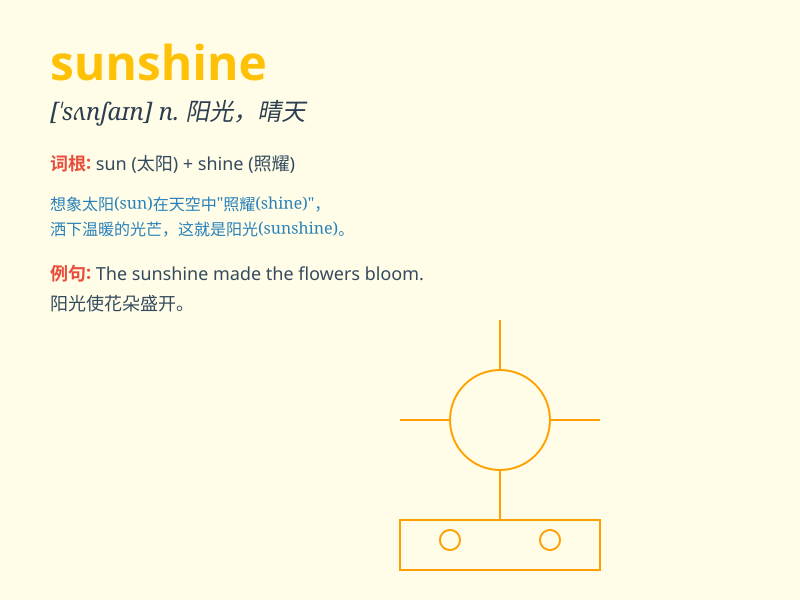

## sunshine

**英音:** _[\'sʌnʃaɪn]_ **美音:** _[\'sʌnʃaɪn]_

**译义:** *n.阳光*

### 短语

+ **bright sunshine:** _明亮的阳光_

+ **warm sunshine:** _温暖的阳光_

+ **enjoy the sunshine:** _享受阳光_

+ **bask in the sunshine:** _晒太阳_

+ **golden sunshine:** _金色的阳光_

### 例句

#### 例句1

> **I enjoy walking in the sunshine.**

**中文翻译:** 我喜欢在阳光下散步。

**单词释义:** 阳光

#### 例句2

> **The room was filled with warm sunshine.**

**中文翻译:** 房间里充满了温暖的阳光。

**单词释义:** 阳光

#### 例句3

> **Her smile is like sunshine on a cloudy day.**

**中文翻译:** 她的笑容就像阴天里的阳光。

**单词释义:** 阳光；给人带来温暖和快乐的事物

### 背诵小故事

> One day, a little girl was sad. But when she went outside and felt
the warm sunshine on her face, she smiled. The sunshine made her forget
her troubles and filled her heart with joy.

**有一天，一个小女孩很伤心。但当她走到外面，感受到温暖的阳光照在她脸上时，她笑了。阳光让她忘记了烦恼，心中充满了喜悦。**

### 图义

