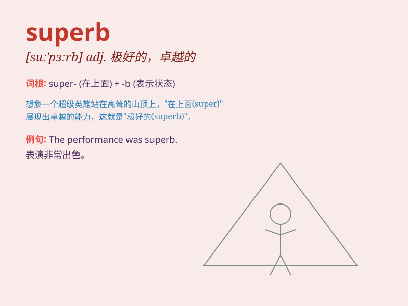

## superb

**英音:** _[suː\'pɜːb; sjuː-]_ **美音:** _[/suːˈpɜːrb/]_

**译义:** *adj.庄重的,堂堂的,华丽的,极好的*

### 短语

+ **superb cuisine:** _极好的美食_

+ **superb performance:** _精彩的表演_

+ **superb view:** _绝佳的景色_

+ **superb quality:** _卓越的品质_

+ **superb skill:** _高超的技能_

### 例句

#### 例句1

> **The view from the mountain top was superb.**

**中文翻译:** 从山顶看到的景色非常棒。

**单词释义:** 极好的；卓越的

#### 例句2

> **She gave a superb performance in the play.**

**中文翻译:** 她在剧中奉献了精彩的表演。

**单词释义:** 出色的；杰出的

#### 例句3

> **The hotel offers superb service and facilities.**

**中文翻译:** 酒店提供一流的服务和设施。

**单词释义:** 极好的；一流的

### 背诵小故事

> A superhero was invited to a party. When he arrived, everyone was
amazed by his superb costume and skills. The word superb means excellent
or outstanding, just like the hero\'s amazing appearance and abilities.

**一位超级英雄被邀请参加派对。当他到达时，每个人都对他极好的服装和技能感到惊叹。superb
这个单词意思是极好的、杰出的，就像这位英雄令人惊叹的外表和能力。**

### 图义

