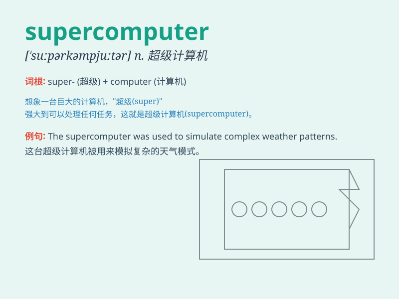

## supercomputer

**英音:** _[ˈsuːpəkəmpjuːtə(r)]_ **美音:**
_[ˈsuːpərkəmpjuːtər]_

**译义:** *n.[计] 超型计算机*

### 短语

+ **supercomputer center:** _超级计算机中心_

+ **supercomputer technology:** _超级计算机技术_

+ **build a supercomputer:** _建造一台超级计算机_

+ **supercomputer system:** _超级计算机系统_

+ **advance in supercomputer:** _超级计算机方面的进展_

### 例句

#### 例句1

> **The research institute has just purchased a powerful
supercomputer for complex data analysis.**

**中文翻译:**
该研究所刚刚购买了一台功能强大的超级计算机，用于复杂的数据分析。

**单词释义:** 超级计算机

#### 例句2

> **The development of supercomputers has greatly accelerated
scientific research in various fields.**

**中文翻译:** 超级计算机的发展极大地加速了各领域的科学研究。

**单词释义:** 超级计算机

#### 例句3

> **This new supercomputer can perform trillions of calculations per
second.**

**中文翻译:** 这台新的超级计算机每秒可以执行数万亿次计算。

**单词释义:** 超级计算机

### 背诵小故事

> In a distant future, a brilliant scientist was working hard. One day,
he successfully invented a SUPERCOMPUTER that could solve complex
problems in seconds. It was so powerful and smart, like a genius in a
machine.

**在遥远的未来，一位杰出的科学家一直在努力工作。有一天，他成功发明了一台超级计算机，能够在几秒钟内解决复杂的问题。它是如此强大和聪明，就像机器中的天才。**

### 图义

