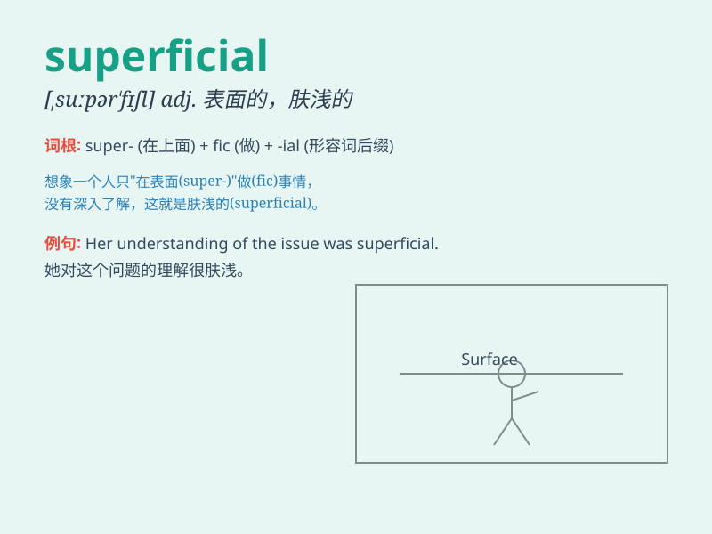

## superficial

**英音:** _[,suːpə\'fɪʃ(ə)l; ,sjuː-]_ **美音:**
_[,supɚ\'fɪʃl]_

**译义:** *adj.表面的,肤浅的,浅薄的*

### 短语

+ **superficial resemblance:** _表面上的相似_

+ **superficial knowledge:** _肤浅的知识_

+ **superficial injury:** _表面的伤害_

+ **superficial charm:** _表面的魅力_

+ **superficial examination:** _表面的检查_

### 例句

#### 例句1

> **His knowledge of the subject was only superficial.**

**中文翻译:** 他对这门学科的了解只是浮于表面。

**单词释义:** 表面的；肤浅的

#### 例句2

> **The superficial scratches on the car can be easily polished
out.**

**中文翻译:** 车上的表面划痕很容易被抛光去掉。

**单词释义:** 表面的

#### 例句3

> **She has a superficial charm but no real depth.**

**中文翻译:** 她有表面的魅力，但没有真正的内涵。

**单词释义:** 表面的；肤浅的

### 背诵小故事

>
想象一下，有个画家只在画布表面随便涂几笔，从不深入刻画细节。这种只做表面功夫的行为就像\'superficial\'。就像只看到人的外表，而不了解内心，这就是肤浅、表面的。

**想象一个画家在画布上只做表面功夫的行为来辅助理解\'superficial\'这个单词，表示肤浅、表面的意思。**

### 图义

