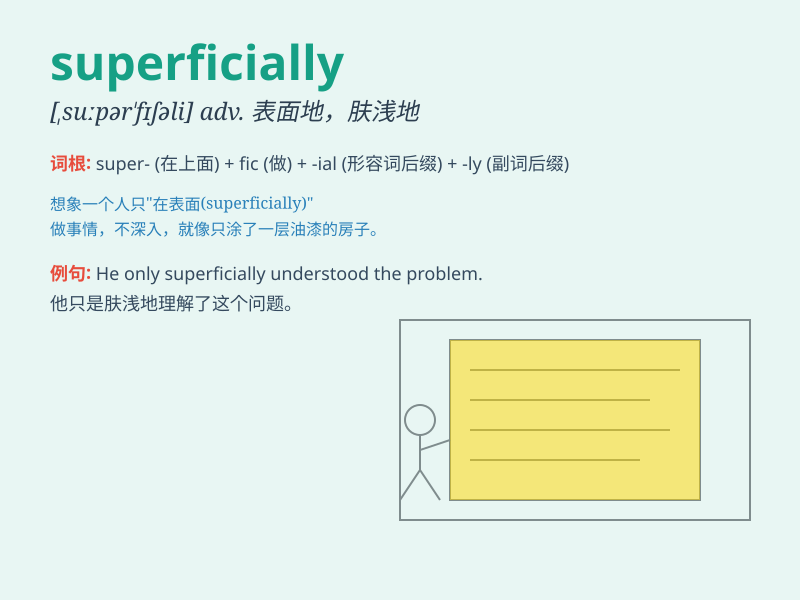

## superficially

**英音:** _[,suːpə\'fɪʃ(ə)lɪ; ,sjuː-]_ **美音:**
_[\'sʊpɚ\'fɪʃəli]_

**译义:** *adv.浅薄地*

### 短语

+ **superficially similar:** _表面上相似_

+ **superficially injured:** _表面受伤_

+ **superficially treated:** _表面处理_

+ **superficially examined:** _表面检查_

+ **superficially understood:** _表面理解_

### 例句

#### 例句1

> **He superficially understood the problem but failed to grasp its
complexity.**

**中文翻译:** 他表面上理解了这个问题，但未能掌握其复杂性。

**单词释义:** 表面上地

#### 例句2

> **The house was superficially renovated to make it look more
attractive.**

**中文翻译:** 这座房子表面上进行了翻新，以使其看起来更有吸引力。

**单词释义:** 表面上地

#### 例句3

> **She superficially agreed with his proposal, but had reservations
in her mind.**

**中文翻译:** 她表面上同意了他的提议，但心里有所保留。

**单词释义:** 表面上地

### 背诵小故事

> A painter superficially covered the wall with a single color. But
when inspected closely, the job was poorly done. It shows that doing
things superficially often leads to unsatisfactory results.

**一位画家表面上用单一的颜色涂了墙。但仔细检查时，工作做得很差。这表明表面上做事往往会导致不满意的结果。**

### 图义

