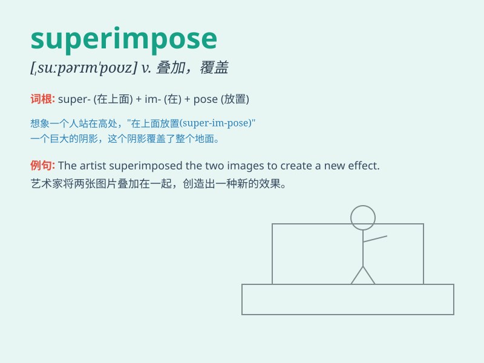

## superimpose

**英音:** _[,suːp(ə)rɪm\'pəʊz; ,sjuː-]_ **美音:**
_[,supərɪm\'poz]_

**译义:** *v.添加,双重*

### 短语

+ **superimpose A on B:** _把 A 叠加在 B 上_

+ **superimpose an image:** _叠加一幅图像_

+ **superimpose patterns:** _叠加图案_

+ **superimpose layers:** _叠加层_

+ **superimpose textures:** _叠加纹理_

### 例句

#### 例句1

> **The artist superimposed one image over another to create a unique
effect.**

**中文翻译:**
这位艺术家将一幅图像叠加在另一幅图像之上以创造出独特的效果。

**单词释义:** 把\...叠加在\...上

#### 例句2

> **They superimposed a map of the new road onto the existing city
plan.**

**中文翻译:** 他们把新道路的地图叠加在现有的城市规划图上。

**单词释义:** 把\...叠加在\...上

#### 例句3

> **The software can superimpose text onto the video.**

**中文翻译:** 该软件能够把文字叠加到视频上。

**单词释义:** 把\...叠加在\...上

### 背诵小故事

> Imagine a magical artist who can superimpose beautiful patterns on a
plain canvas. He takes one image and places it precisely over another,
creating a new and unique work. That\'s like what \'superimpose\' means!

**想象一位神奇的艺术家，他能在一张空白的画布上叠加美丽的图案。他把一个图像精准地放置在另一个上面，创造出全新独特的作品。这就像\'superimpose\'这个单词的意思！**

### 图义

