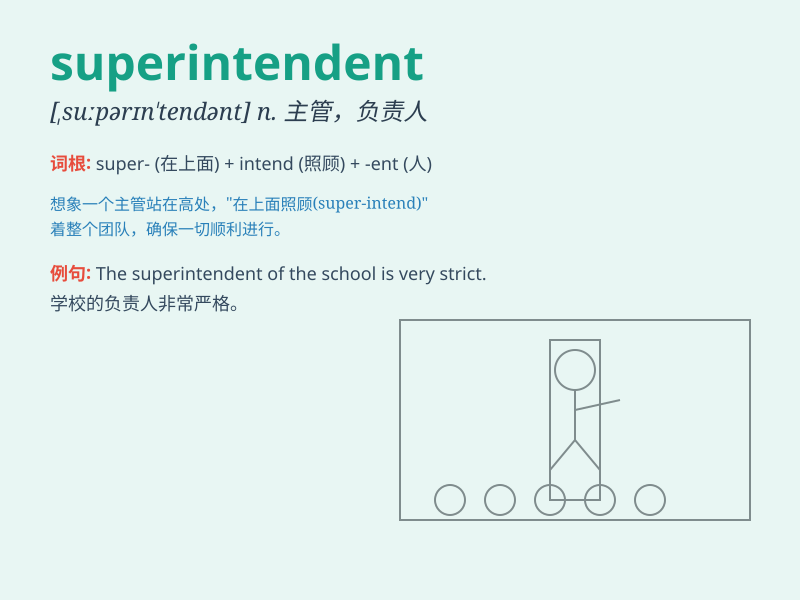

## superintendent

**英音:** _[suːp(ə)rɪn\'tend(ə)nt; sjuː-]_ **美音:**
_[,supərɪn\'tɛndənt]_

**译义:** *n.主管,负责人,指挥者,管理者*

### 短语

+ **school superintendent:** _学校负责人；学校主管_

+ **building superintendent:** _大楼管理员_

+ **police superintendent:** _警司_

+ **superintendent of works:** _工程主管_

+ **superintendent engineer:** _主管工程师_

### 例句

#### 例句1

> **The superintendent of the school is responsible for its overall
management.**

**中文翻译:** 学校的负责人负责其整体管理。

**单词释义:** 负责人；主管

#### 例句2

> **The police superintendent ordered an immediate investigation into
the crime.**

**中文翻译:** 警察局长下令立即对犯罪进行调查。

**单词释义:** 警长；警司

#### 例句3

> **The building superintendent fixed the leaky faucet in my
apartment.**

**中文翻译:** 大楼管理员修好了我公寓里漏水的水龙头。

**单词释义:** 管理员

### 背诵小故事

> 想象一个超级英雄，他负责管理整个城市的秩序，大家都称他为
superintendent。他拥有超强的智慧和能力，确保城市的安全与和谐。

**想象一个负责管理整个城市秩序的超级英雄被称为主管**

### 图义

