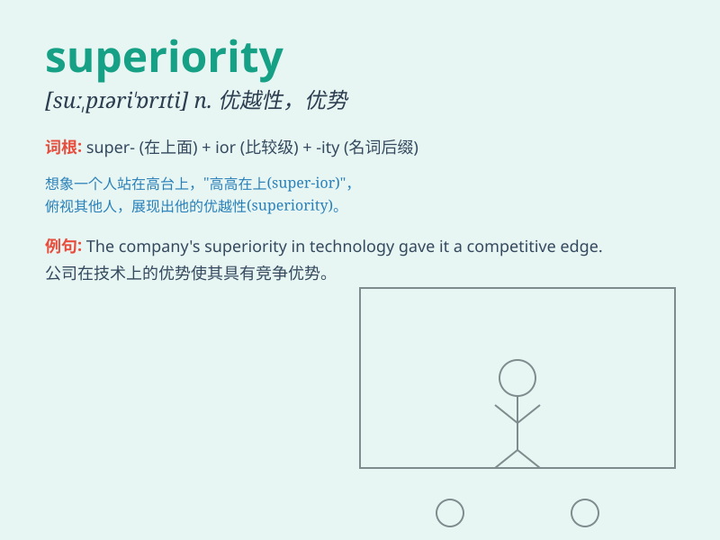

## superiority

**英音:** _[suː,pɪərɪ\'ɒrɪtɪ; sjuː-]_ **美音:**
_[su,pɪrɪ\'ɔrəti]_

**译义:** *n.优越,高傲*

### 短语

+ **sense of superiority:** _优越感_

+ **military superiority:** _军事优势_

+ **technological superiority:** _技术优势_

+ **competitive superiority:** _竞争优势_

+ **strategic superiority:** _战略优势_

### 例句

#### 例句1

> **The enemy claimed a false superiority over us.**

**中文翻译:** 敌人声称对我们有虚假的优势。

**单词释义:** 优势

#### 例句2

> **His superiority in the field of science is widely recognized.**

**中文翻译:** 他在科学领域的优越性被广泛认可。

**单词释义:** 优越性

#### 例句3

> **The team\'s superiority was evident in their consistent
victories.**

**中文翻译:** 这个团队的优势在他们持续的胜利中很明显。

**单词释义:** 优势

### 背诵小故事

> A small ant always thought it was inferior. But one day, it
discovered its ability to carry heavy food, realizing its superiority
over other weak insects. It understood that superiority doesn\'t mean
being the biggest, but having unique skills.

**一只小蚂蚁总觉得自己低人一等。但有一天，它发现自己能搬运很重的食物，意识到自己比其他弱小的昆虫有优势。它明白了优势不意味着体型最大，而是拥有独特的技能。**

### 图义

