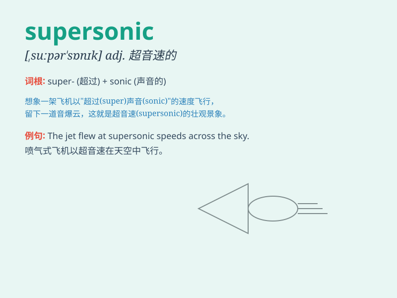

## supersonic

**英音:** _[suːpə\'sɒnɪk; sjuː-]_ **美音:**
_[,supɚ\'sɑnɪk]_

**译义:** *adj.超音波的n.超声波,超声频*

### 短语

+ **supersonic speed:** _超音速_

+ **supersonic aircraft:** _超音速飞机_

+ **supersonic flow:** _超音速流_

+ **supersonic missile:** _超音速导弹_

+ **supersonic boom:** _超音速爆音_

### 例句

#### 例句1

> **The supersonic jet flew across the sky at an astonishing
speed.**

**中文翻译:** 这架超音速喷气式飞机以惊人的速度飞过天空。

**单词释义:** 超音速的

#### 例句2

> **The new car is designed to reach supersonic speeds.**

**中文翻译:** 这辆新车被设计成能达到超音速的速度。

**单词释义:** 超音速的

#### 例句3

> **The missile has a supersonic propulsion system.**

**中文翻译:** 这枚导弹有一个超音速推进系统。

**单词释义:** 超音速的

### 背诵小故事

> A brave pilot was flying a supersonic jet. It was so fast that it
left a sonic boom behind. People on the ground were amazed by the speed.
The pilot felt proud to control this supersonic wonder.

**一位勇敢的飞行员正在驾驶一架超音速飞机。它速度极快，身后留下了音爆。地面上的人们对其速度感到惊叹。飞行员为能操控这架超音速的神奇飞机而感到自豪。**

### 图义

