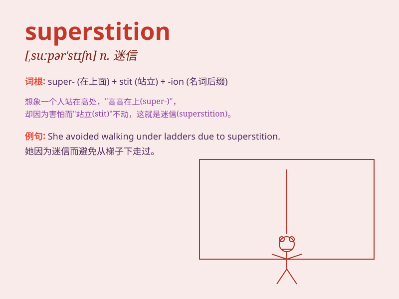

## superstition

**英音:** _[,suːpə\'stɪʃ(ə)n; ,sjuː-]_ **美音:**
_[,supɚ\'stɪʃən]_

**译义:** *n.迷信*

### 短语

+ **be rooted in superstition:** _根源于迷信_

+ **break away from superstition:** _摆脱迷信_

+ **fall into superstition:** _陷入迷信_

+ **rife with superstition:** _充满迷信_

+ **shake off superstition:** _摆脱迷信_

### 例句

#### 例句1

> **Superstition often leads people to make irrational decisions.**

**中文翻译:** 迷信常常导致人们做出非理性的决定。

**单词释义:** 迷信

#### 例句2

> **We should abandon superstition and rely on science and
reason.**

**中文翻译:** 我们应该摒弃迷信，依靠科学和理性。

**单词释义:** 迷信

#### 例句3

> **His fear was based on superstition rather than reality.**

**中文翻译:** 他的恐惧是基于迷信而不是现实。

**单词释义:** 迷信

### 背诵小故事

> One day, Tom was lost in a dark forest. He believed in a superstition
that if he found a four-leaf clover, he would be safe. After a long
search, he finally found it and found his way out.

**有一天，汤姆在一片黑暗的森林里迷路了。他相信一个迷信说法，如果他能找到一片四叶草，他就会安全。经过长时间的寻找，他终于找到了，并走出了森林。**

### 图义

