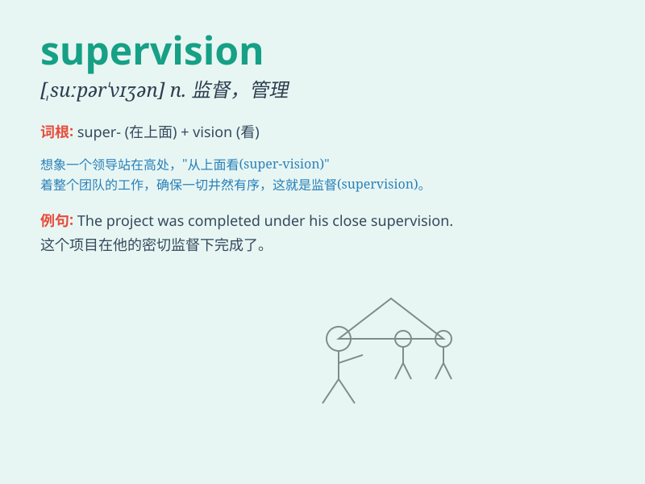

## supervision

**英音:** _[,suːpə\'vɪʒn; ,sjuː-]_ **美音:**
_[,sʊpɚ\'vɪʒən]_

**译义:** *n.监督,管理*

### 短语

+ **close supervision:** _严密监督_

+ **constant supervision:** _持续监督_

+ **under supervision:** _在监督之下_

+ **effective supervision:** _有效监督_

+ **intense supervision:** _强烈监督_

### 例句

#### 例句1

> **The project is under strict supervision to ensure its
success.**

**中文翻译:** 这个项目处于严格的监督之下以确保其成功。

**单词释义:** 监督

#### 例句2

> **Children need proper supervision when they play in the park.**

**中文翻译:** 孩子们在公园玩耍时需要适当的监管。

**单词释义:** 监管

#### 例句3

> **The quality of the products is subject to continuous
supervision.**

**中文翻译:** 产品的质量受到持续的监督。

**单词释义:** 监督

### 背诵小故事

> A young detective was under the supervision of a veteran. The veteran
guided him carefully, making sure he did everything right.
\'Supervision\' means close observation and direction to ensure
something is done properly.

**一位年轻的侦探在一位老手的监督之下。老手仔细地引导他，确保他做的一切都是正确的。\'supervision\'意思是密切的观察和指导以确保事情正确完成。**

### 图义

