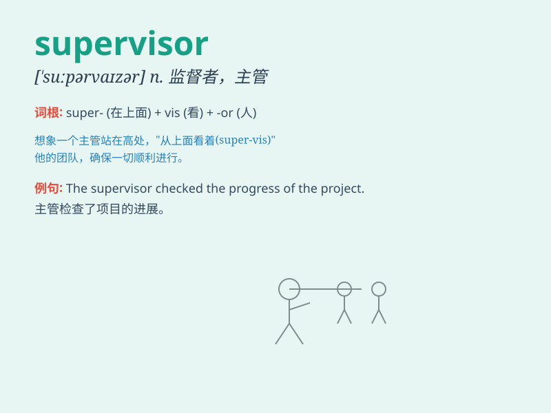

## supervisor

**英音:** _[\'suːpəvaɪzə; \'sjuː]_ **美音:**
_[\'supɚvaɪzɚ]_

**译义:**
*n.监督人,管理人,检查员,督学,主管人,[计](网络)超级用户*

### 短语

+ **project supervisor:** _项目主管_

+ **production supervisor:** _生产主管_

+ **quality supervisor:** _质量主管_

+ **shift supervisor:** _值班主管_

+ **sales supervisor:** _销售主管_

### 例句

#### 例句1

> **The supervisor was very strict with the workers.**

**中文翻译:** 这位主管对工人非常严格。

**单词释义:** 主管；监督人

#### 例句2

> **I need to report to my supervisor about the progress of the
project.**

**中文翻译:** 我需要向我的主管汇报项目的进展情况。

**单词释义:** 主管；监督人

#### 例句3

> **The supervisor has the authority to make important decisions.**

**中文翻译:** 这位主管有权做出重要决定。

**单词释义:** 主管；监督人

### 背诵小故事

> A young employee was always nervous when facing the supervisor. One
day, he made a mistake. But the supervisor was kind and helped him fix
it. From then on, he knew a supervisor is not just for checking but also
for guiding.

**一位年轻员工面对主管时总是很紧张。有一天，他犯了个错误。但主管很友善，帮他改正了。从那以后，他知道主管不仅是检查工作，还会指导工作。**

### 图义

