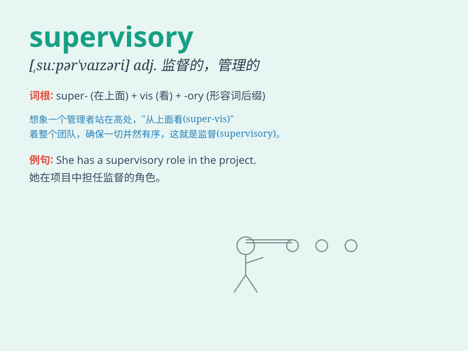

## supervisory

**英音:** _[ˌsuːpəˈvaɪzəri]_ **美音:**
_[ˌsuːpərˈvaɪzəri]_

**译义:** *adj.管理的,监督的*

### 短语

+ **supervisory board:** _监事会；监督委员会_

+ **supervisory authority:** _监管当局；监督权威_

+ **supervisory position:** _监督职位；管理岗位_

+ **supervisory role:** _监督角色；管理作用_

+ **supervisory staff:** _监督人员；管理人员_

### 例句

#### 例句1

> **The supervisory committee is responsible for monitoring the
company\'s operations.**

**中文翻译:** 监督委员会负责监督公司的运营。

**单词释义:** 监督的

#### 例句2

> **He has taken on a supervisory role in the new project.**

**中文翻译:** 他在新项目中担任了监督的角色。

**单词释义:** 监督的

#### 例句3

> **The supervisory staff conducted regular inspections of the
factory.**

**中文翻译:** 监督人员对工厂进行定期检查。

**单词释义:** 监督的

### 背诵小故事

> A young man aspired to a supervisory position. He worked hard,
overseeing every detail. Finally, his excellent supervisory skills got
him promoted. Now he supervises the team effectively.

**一个年轻人渴望获得管理职位。他努力工作，监督每一个细节。最终，他出色的监督技能使他得到晋升。现在他有效地管理着团队。**

### 图义

