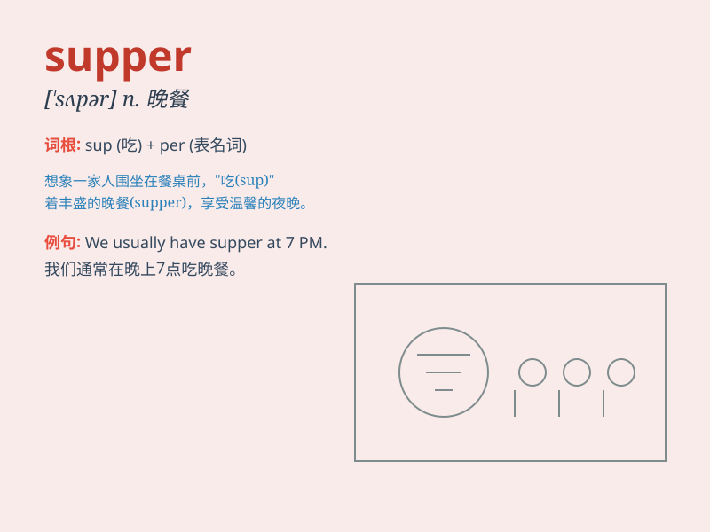

## supper

**英音:** _[\'sʌpə]_ **美音:** _[\'sʌpɚ]_

**译义:** *n.晚餐*

### 短语

+ **have supper:** _吃晚饭_

+ **after supper:** _晚饭后_

+ **supper time:** _晚餐时间_

+ **prepare supper:** _准备晚餐_

+ **enjoy supper:** _享受晚餐_

### 例句

#### 例句1

> **We usually have supper at seven o\'clock.**

**中文翻译:** 我们通常在七点吃晚饭。

**单词释义:** 晚饭

#### 例句2

> **After supper, I like to take a walk.**

**中文翻译:** 晚饭后，我喜欢散步。

**单词释义:** 晚饭

#### 例句3

> **The family enjoyed a delicious supper together.**

**中文翻译:** 这家人一起享用了一顿美味的晚餐。

**单词释义:** 晚餐

### 背诵小故事

> One day, a little boy was very hungry after playing outside. When he
came home, his mother prepared a delicious meal for him. This meal in
the evening was called supper. The boy enjoyed it very much.

**有一天，一个小男孩在外面玩耍后非常饿。当他回家时，他的妈妈为他准备了一顿美味的饭。这顿晚上的饭被称为晚餐。小男孩吃得非常开心。**

### 图义

